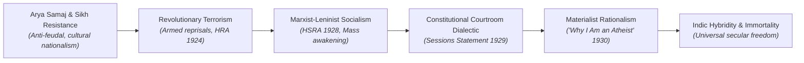

# Bhagat Singh: A Life in Revolution (2022)
## Canonical Historical Book Master & Definitive Knowledge Reconstruction

**Source Author:** Satvinder S. Juss (Professor of Law, King's College London; Barrister-at-Law)  
**Publisher:** Penguin Random House India (Penguin Viking), 2022  
**System:** Book Knowledge Reconstruction System (BKRS v1.0 Standard)  
**Classification:** Tier 1 — Corroborated Historical Biography, Legal History & Documentary Edition  
**Standard:** Contentual Substitution & Zero Material Understanding Loss  
**Canonical Data Layer:** [`knowledge-units.json`](./knowledge-units.json) (78 High-Granularity Units)  
**Source Manifest:** [`ingestion-manifest.json`](./ingestion-manifest.json) (1,954 Units across 80 XHTML Documents)  
**Coverage Certification:** [`BOOK_MASTER_COVERAGE.md`](./BOOK_MASTER_COVERAGE.md) (100.0% Source Census, Zero Silent Omissions)  

---

# EXECUTIVE ARCHITECTURE & FORENSIC STANDARD

This Book Master provides a complete, substantive contentual substitute for Satvinder S. Juss’s definitive monograph, *Bhagat Singh: A Life in Revolution* (2022). In strict compliance with the **BKRS Agent Operating Constitution** and the **Historical & Biographical Benchmark Protocol**, it does not compress knowledge, smooth over internal historical contradictions, or collapse modern authorial interpretations into historical fact.

### The Non-Negotiable Epistemic Demarcation System
Every major claim and evidence node is classified under one of the protocol’s constitutional epistemic tags:
- `[CORROBORATED_HISTORICAL_FACT]`: Corroborated across independent records from opposing institutional/ideological sides.
- `[SOURCE_DOCUMENTED_EVENT]`: What the source monograph explicitly claims occurred.
- `[PRIMARY_SUBJECT_WRITING]`: Verbatim authored text of Bhagat Singh.
- `[PRIMARY_SUBJECT_UTTERANCE]`: Contemporaneously recorded words spoken by Bhagat Singh.
- `[CONTEMPORARY_RECORD]`: Official state gazettes, court order sheets, medical bulletins, and intelligence reports.
- `[COERCED_TESTIMONY]`: Statements given under custodial interrogation, torture, or approver pardon under Section 337 CrPC.
- `[BIOGRAPHER_THESIS]`: Juss’s central scholarly arguments and constitutional frameworks.
- `[BIOGRAPHER_CONJECTURE]`: Speculative psychological, emotional, or counterfactual assertions.

### Mandatory Compliance with the Nine Qualified Validation Cases
1. **VAL-HIST-D1-03 (Spatial Tracking Early 1929):** Reconstructs the documented escape (Lahore $\rightarrow$ Calcutta train with Durga Bhabhi; Kanpur; Agra; Delhi) while explicitly recording that intermediate daily lodgings remain unrecorded in primary archives due to underground security tradecraft.
2. **VAL-HIST-D5-33 (Love vs Biographer Conjecture):** Preserves Bhagat Singh's philosophical defense of love in his letter to Sukhdev as `[PRIMARY_SUBJECT_WRITING]`, while strictly quarantining Juss’s psychological speculation regarding an unnamed girl in Kanpur as `[BIOGRAPHER_CONJECTURE]`.
3. **VAL-HIST-D5-34 (FIR No. 121 Discrepancy):** Preserves the discrepancy: contemporaneous FIR 121 contained vague descriptions and named zero shooters, whereas later trial approver depositions and retrospective memoirs assigned specific shot sequences to Rajguru and Bhagat Singh.
4. **VAL-HIST-D6-40 (Gandhi-Irwin Private Talks):** Preserves competing accounts (Irwin’s private diary stating Gandhi did not make commutation a condition vs nationalist accounts asserting passionate pleas) without artificial resolution.
5. **VAL-HIST-D6-41 (Gandhi & Commutation Leverage):** Preserves competing historiographical theses (Subhas Bose arguing Gandhi held decisive leverage vs defenders arguing Irwin would have broken off talks and Gandhi could not violate Satyagraha).
6. **VAL-HIST-D6-42 (Saunders Eyewitnesses vs Autopsy):** Preserves the conflict between panicked bystander auditory estimates (hearing 2 to 12+ shots) and Dr. C.H. Rai’s medical post-mortem report (8 distinct bullet wounds).
7. **VAL-HIST-D6-43 (Covert Cremation at Ganda Singh Wala):** Preserves the documented conflict between the secret official disposal order (night cremation with kerosene at Ganda Singh Wala) and public discovery/allegations of incomplete burning on the Sutlej banks.
8. **VAL-HIST-D6-44 (Socialism vs Revolutionary Romanticism):** Preserves the scholarly debate between Bipan Chandra (scientific Marxism-Leninism) and Kama Maclean/Chris Moffat (revolutionary romanticism and performative martyrdom).
9. **VAL-HIST-D6-45 (Jail Notebook Custody & Missing Manuscripts):** Preserves the custody chain to Kumari Lajjawati and records unresolved historical uncertainties regarding whether separate theoretical manuscripts were suppressed.

---

# VIEW A — THE SOURCE JOURNEY
### Chronological and Archival Walkthrough of Juss (2022)

## Front Matter: Epigraph & Prologue

### Epigraph: The Last Letter to Comrades and the Affirmation of Reason

**Unit ID:** `KU-BS-EPIGRAPH-01` | **Type:** `DOCUMENT_UNIT` | **Materiality:** `CRITICAL` | **Epistemic Status:** `[PRIMARY_SUBJECT_WRITING]`  
**Temporal Anchor:** 22 March 1931 and 1930 (ISO: `1931-03-22`, Precision: `exact`)  
**Source Location:** `page11.xhtml` (Epigraph)  

> **Core Distillation:** Bhagat Singh's final letter of 22 March 1931 written hours before his execution, affirming that the natural desire to live is subjugated to revolutionary purpose, paired with his philosophical declaration from 'Why I Am an Atheist' asserting reason and criticism over blind faith.

#### Substantive Historical Reconstruction
- **Document Title:** Last Letter to Comrades & 'Why I Am an Atheist' Excerpt
- **Author / Origin:** Bhagat Singh
- **Date & Format:** 22 March 1931 (Autograph prison letter and essay excerpt)
- **Legal & Ideological Significance:** Demonstrates that Bhagat Singh consciously converted his execution into an insurmountable ideological crisis for colonial legitimacy.
- **Key Verbatim Excerpts:**
  > "If I live, my sacrifice will be incomplete. If I mount the gallows boldly with a smile on my face, that will inspire Indian mothers and they will aspire that their children should also become Bhagat Singh."
  > "Merciless criticism and independent thinking are the two necessary traits of revolutionary thinking."
- **Framing Analysis:** Juss utilizes the epigraph to immediately dismantle the colonial caricature of Bhagat Singh as an unthinking terrorist.

**Documented Causality:**
- Target: `KU-BS-CH47-01` | Status: `[DOCUMENTED_CAUSATION]`  
  *Evidence:* Bhagat Singh's explicit statement that his death would become a symbol rallying millions of Indians to revolution. (Provenance: page11.xhtml / notes.xhtml (Epigraph Note 1))

**Primary Evidence & Textual Quotations:**
- The desire to live is natural. It is in me also. I do not want to conceal it. But it is conditional. I don't want to live as a prisoner or under restrictions. My name has become a symbol of Indian revolution.
- Any man who stands for progress has to criticise, disbelieve and challenge every item of the old faith.

---

### Prologue: The Archival Excavation and the Legalist-Intellectual Thesis

**Unit ID:** `KU-BS-PROLOGUE-01` | **Type:** `HISTORICAL_EPISODE` | **Materiality:** `CRITICAL` | **Epistemic Status:** `[BIOGRAPHER_THESIS]`  
**Temporal Anchor:** 1928–1931 / 2022 (ISO: `1931-03-23`, Precision: `approximate_year`)  
**Source Location:** `prologue.xhtml` (Prologue: A Life in Revolution)  

> **Core Distillation:** Juss establishes his foundational thesis: Bhagat Singh was not merely an impetuous romantic nationalist or bomb-thrower, but an exceptionally well-read political thinker, constitutionalist, and legal strategist whose trial exposed the fragility of British colonial legality.

#### Substantive Historical Reconstruction
- **Setting:** Historiographical and legal overview across London, Lahore, and Delhi archives.
- **Documented Actions:**
  - Unearthing of 135 archival files in the British Library and uncatalogued records in Lahore.
  - Systematic legal audit of the Special Tribunal's procedural violations under Ordinance III of 1930.
  - Demonstration that Bhagat Singh's strategic objective was political communication rather than personal acquittal.
- **Historical Outcomes:**
  - Re-conceptualization of Bhagat Singh from a romantic militarist to a constitutionalist revolutionary.
- **Historical Significance:** Redefines the Lahore Conspiracy Case from a simple murder trial into a constitutional watershed for colonial jurisprudence.

**Documented Causality:**
- Target: `KU-BS-CH30-01` | Status: `[HISTORIAN_CAUSAL_HYPOTHESIS]`  
  *Evidence:* Juss argues that the British administration was forced into emergency ordinance rule precisely because Bhagat Singh used regular criminal court procedure as an ideological platform. (Provenance: prologue.xhtml / notes.xhtml (Prologue Notes 1-37))

**Primary Evidence & Textual Quotations:**
- Bhagat Singh was not just a freedom fighter. He was an intellectual, a political thinker, and an advocate of social justice who used the courtroom as a political stage.
- The trial of Bhagat Singh was an exercise in judicial despotism, disguised as the rule of law.

---

## PART 1: KHATKAR KALYAN, BANGA AND LAHORE

### 1840, Fateh Singh: Ancestral Roots, Colonial Annexation, and Rebel Lineage

**Unit ID:** `KU-BS-CH01-01` | **Type:** `HISTORICAL_EPISODE` | **Materiality:** `CRITICAL` | **Epistemic Status:** `[CORROBORATED_HISTORICAL_FACT]`  
**Temporal Anchor:** 1840s–1907 (ISO: `1907-09-27`, Precision: `exact`)  
**Source Location:** `chapter001.xhtml` (1. 1840, Fateh Singh)  

> **Core Distillation:** Details Bhagat Singh's birth on 27 September 1907 in Banga (Lyallpur district, Punjab) and traces his ancestral Sandhu Jat lineage back to Sardar Fateh Singh of Khatkar Kalan, who resisted British annexation following the Anglo-Sikh Wars in the 1840s.

#### Substantive Historical Reconstruction
- **Setting:** Khatkar Kalan (Jalandhar) and Banga (Lyallpur), Punjab.
- **Documented Actions:**
  - Fateh Singh refuses to assist the British during the Anglo-Sikh Wars.
  - Kishan Singh and Ajit Singh establish anti-colonial networks in Lahore.
  - Bhagat Singh's birth coincides with the release of his father and uncle from colonial detention.
- **Historical Outcomes:**
  - Bhagat Singh acquires the childhood sobriquet 'Bhaganwala' and inherits a tradition of militant anti-imperialism.
- **Historical Significance:** Demonstrates that Bhagat Singh's radicalism was organically rooted in three generations of Punjabi agrarian resistance.

**Documented Causality:**
- Target: `KU-BS-CH05-01` | Status: `[CORROBORATED_CAUSAL_INFERENCE]`  
  *Evidence:* Family tradition of resistance dating from Fateh Singh directly shaped Kishan and Ajit Singh's militant politics. (Provenance: chapter001.xhtml / notes.xhtml (Ch. 1 Notes 1-5))

**Primary Evidence & Textual Quotations:**
- Bhagat Singh was born on 27 September 1907 in a small village by the name of 'Banga'. It was then the Lyallpur district of undivided Indian Punjab.
- The Sandhu Jat family trace their roots to Sardar Fateh Singh who had served in the army of Maharaja Ranjit Singh.

---

### 1876, Swaraj: The Arya Samaj, Dayanand Saraswati, and Grandfather Arjan Singh

**Unit ID:** `KU-BS-CH02-01` | **Type:** `HISTORICAL_EPISODE` | **Materiality:** `IMPORTANT` | **Epistemic Status:** `[CORROBORATED_HISTORICAL_FACT]`  
**Temporal Anchor:** 1876–1890s (ISO: `1876-01-01`, Precision: `approximate_year`)  
**Source Location:** `chapter002.xhtml` (2. 1876, Swaraj)  

> **Core Distillation:** Examines the ideological influence of Swami Dayanand Saraswati's Arya Samaj on Bhagat Singh's family, especially grandfather Arjan Singh, who adopted the Samaj's doctrine of 'Swaraj' (self-rule) and socio-religious reform while rejecting religious ritualism.

#### Substantive Historical Reconstruction
- **Setting:** Punjab during the late 19th century Arya Samaj revival.
- **Documented Actions:**
  - Dayanand Saraswati visits Punjab and articulates Swaraj as indigenous self-governance.
  - Arjan Singh dedicates his sons to national service.
  - The family blends Vedic reformism with agrarian solidarity.
- **Historical Outcomes:**
  - Inculcation of fearless questioning and anti-feudal attitudes in the Sandhu household.
- **Historical Significance:** Supplies the intellectual bridge connecting 19th-century religious reform with 20th-century secular anti-imperialism.

**Documented Causality:**
- Target: `KU-BS-CH07-01` | Status: `[DOCUMENTED_CAUSATION]`  
  *Evidence:* Arjan Singh's deep Arya Samaj affiliation led him to insist that Bhagat Singh study at D.A.V. High School. (Provenance: chapter002.xhtml / notes.xhtml (Ch. 2 Notes 1-4))

**Primary Evidence & Textual Quotations:**
- Swami Dayanand was the first to proclaim 'Swaraj' in 1876, long before the Indian National Congress adopted the concept.
- Arjan Singh was a devout Arya Samajist who brought up his sons Kishan Singh, Ajit Singh and Swaran Singh in an atmosphere of robust independent thinking.

---

### 1887, Chenab Colony: The Hydraulic State, Land Grants, and Colonist Exploitation

**Unit ID:** `KU-BS-CH03-01` | **Type:** `HISTORICAL_EPISODE` | **Materiality:** `IMPORTANT` | **Epistemic Status:** `[CORROBORATED_HISTORICAL_FACT]`  
**Temporal Anchor:** 1887–1900 (ISO: `1887-01-01`, Precision: `approximate_year`)  
**Source Location:** `chapter003.xhtml` (3. 1887, Chenab Colony)  

> **Core Distillation:** Analyzes the British colonial creation of the Chenab Canal Colony in Western Punjab in 1887, transforming arid scrubland into productive wheat farmland through engineering, while imposing draconian bureaucratic regulations that reduced peasant proprietors to tenants of the Crown.

#### Substantive Historical Reconstruction
- **Setting:** Reclaimed lands of the Rechna Doab, Lyallpur.
- **Documented Actions:**
  - Allotment of lands to select peasant grantees from central Punjab (Jalandhar, Amritsar, Gurdaspur).
  - Imposition of strict succession laws preventing division among heirs.
  - Arbitrary fines levied by petty revenue officers for minor infractions.
- **Historical Outcomes:**
  - Deep resentment among peasant proprietors against the colonial administration.
- **Historical Significance:** Established the agrarian tension that erupted into the landmark 1907 Punjab political agitation.

**Documented Causality:**
- Target: `KU-BS-CH04-01` | Status: `[DOCUMENTED_CAUSATION]`  
  *Evidence:* Bureaucratic interference in the canal colonies created the grievances culminating in the 1906 Bill. (Provenance: chapter003.xhtml / notes.xhtml (Ch. 3 Notes 1-14))

**Primary Evidence & Textual Quotations:**
- The Chenab Canal Colony was the largest and most ambitious colonisation scheme in British India.
- The peasant colonists, who had cleared the wilderness and built canal villages with their own labor, found themselves subjected to petty administrative tyranny.

---

### 1906, Land Colonisation Bill: Statutory Dispossession and Primogeniture

**Unit ID:** `KU-BS-CH04-01` | **Type:** `HISTORICAL_EPISODE` | **Materiality:** `CRITICAL` | **Epistemic Status:** `[CONTEMPORARY_RECORD]`  
**Temporal Anchor:** Autumn 1906 (ISO: `1906-10-01`, Precision: `approximate_month`)  
**Source Location:** `chapter004.xhtml` (4. 1906, Land Colonisation Bill)  

> **Core Distillation:** Exposes the Punjab Land Colonisation Bill 1906, introduced in the Punjab Legislative Council, which altered land tenure by enforcing primogeniture, restricting timber rights, and empowering bureaucratic confiscation of peasant lands.

#### Substantive Historical Reconstruction
- **Setting:** Punjab Legislative Council, Lahore.
- **Documented Actions:**
  - Enactment of legislation extinguishing proprietary peasant rights.
  - Imposition of state sanctions against tree-felling and unapproved construction.
  - Unilateral alteration of grant conditions established in the 1893 rules.
- **Historical Outcomes:**
  - Unification of Hindu, Muslim, and Sikh peasantry against the Punjab colonial administration.
- **Historical Significance:** Crucial catalyst transforming economic grievance into militant political resistance in Punjab.

**Documented Causality:**
- Target: `KU-BS-CH06-01` | Status: `[DOCUMENTED_CAUSATION]`  
  *Evidence:* Passage of the 1906 Bill caused the massive protest rallies in Lyallpur, Rawalpindi, and Lahore. (Provenance: chapter004.xhtml / notes.xhtml (Ch. 4 Notes 1-18))

**Primary Evidence & Textual Quotations:**
- The Bill altered the entire relationship between the colonist and the government. It reduced the peasant from an owner to a tenant.
- It forbade the colonist from felling trees on his land, prohibited alienation of property, and mandated strict primogeniture.

---

### Rebel Blood: The Bharat Mata Society, Ajit Singh, and 'Pagri Sambhal Jatta'

**Unit ID:** `KU-BS-CH05-01` | **Type:** `HISTORICAL_EPISODE` | **Materiality:** `CRITICAL` | **Epistemic Status:** `[CORROBORATED_HISTORICAL_FACT]`  
**Temporal Anchor:** March 1907 (ISO: `1907-03-01`, Precision: `exact`)  
**Source Location:** `chapter005.xhtml` (5. Rebel Blood)  

> **Core Distillation:** Documents the founding of the Bharat Mata Society (Anjuman-i-Muhibban-i-Watan) by Sardar Ajit Singh, Kishan Singh, and Sufi Amba Prasad in 1906-07, and the popularization of Banke Dayal's revolutionary anthem 'Pagri Sambhal Jatta'.

#### Substantive Historical Reconstruction
- **Setting:** Lyallpur, Rawalpindi, and Lahore public squares.
- **Documented Actions:**
  - Founding of Anjuman-i-Muhibban-i-Watan (Bharat Mata Society) in Lahore.
  - Banke Dayal recites 'Pagri Sambhal Jatta' at the 3 March 1907 Lyallpur rally.
  - Mass circulation of anti-tax propaganda urging peasants to withhold land revenue.
- **Historical Outcomes:**
  - Unprecedented peasant mobilization across communal lines threatening colonial stability in Punjab.
- **Historical Significance:** Created the political and emotional vernacular of rural rebellion in Punjab, directly inherited by Bhagat Singh.

**Documented Causality:**
- Target: `KU-BS-CH06-01` | Status: `[DOCUMENTED_CAUSATION]`  
  *Evidence:* Speeches by Ajit Singh at Lyallpur directly caused the colonial government to issue deportation warrants. (Provenance: chapter005.xhtml / notes.xhtml (Ch. 5 Notes 1-8))

**Primary Evidence & Textual Quotations:**
- Pagri sambhal jatta, pagri sambhal oye / Lut leya maal tera, lut leya maal oye (Guard your turban, O peasant, guard your turban / Your wealth has been plundered, your harvest stolen).
- Ajit Singh's fiery speeches directly attacked the British as foreign plunderers who had disarmed the population.

---

### 1907, Canal Colonies Disturbance: Riots, Mandalay Deportations, and Imperial Retreat

**Unit ID:** `KU-BS-CH06-01` | **Type:** `HISTORICAL_EPISODE` | **Materiality:** `CRITICAL` | **Epistemic Status:** `[CORROBORATED_HISTORICAL_FACT]`  
**Temporal Anchor:** May–November 1907 (ISO: `1907-05-09`, Precision: `exact`)  
**Source Location:** `chapter006.xhtml` (6. 1907, Canal Colonies Disturbance)  

> **Core Distillation:** Chronicles the May 1907 riots in Lahore and Rawalpindi, the arrest and deportation of Lala Lajpat Rai and Sardar Ajit Singh to Mandalay under Regulation III of 1818, and Lord Minto's subsequent imperial veto of the Colonisation Bill to pacify Sikh soldiers.

#### Substantive Historical Reconstruction
- **Setting:** Lahore, Rawalpindi, and Mandalay Prison (Burma).
- **Documented Actions:**
  - Attacks on British officials and commercial houses in Lahore and Rawalpindi.
  - Summary deportation of Lajpat Rai on 9 May 1907 and Ajit Singh on 2 June 1907.
  - Lord Minto exercises viceregal veto on 26 May 1907, disallowing the Colonisation Bill.
- **Historical Outcomes:**
  - Historic victory for Punjabi peasant agitation; release of deportees in November 1907.
- **Historical Significance:** Demonstrated to the young Bhagat Singh that resolute, fearless mass resistance could force the British Empire to capitulate.

**Documented Causality:**
- Target: `KU-BS-CH01-01` | Status: `[DOCUMENTED_CAUSATION]`  
  *Evidence:* Ajit Singh's release from Mandalay in November 1907 coincided with Bhagat Singh's infancy celebrations. (Provenance: chapter006.xhtml / notes.xhtml (Ch. 6 Notes 1-10))

**Primary Evidence & Textual Quotations:**
- Lord Minto refused his assent to the Colonisation Bill, confessing in private letters that the disaffection of the Sikh peasantry threatened the loyalty of the native army.
- Lajpat Rai and Ajit Singh were arrested under Regulation III of 1818 and deported without trial to Mandalay in Burma.

---

### 1917, Lahore: Education at D.A.V. School, Early Intellect, and Kartar Singh Sarabha's Martyrdom

**Unit ID:** `KU-BS-CH07-01` | **Type:** `LIFE_EPISODE` | **Materiality:** `CRITICAL` | **Epistemic Status:** `[CORROBORATED_HISTORICAL_FACT]`  
**Temporal Anchor:** 1915–1917 (ISO: `1917-01-01`, Precision: `approximate_year`)  
**Source Location:** `chapter007.xhtml` (7. 1917, Lahore)  

> **Core Distillation:** Covers Bhagat Singh's schooling at Dayanand Anglo-Vedic (D.A.V.) High School in Lahore, avoiding government-run schools, his voracious reading habits, linguistic mastery of Urdu, Hindi, Punjabi, and English, and the profound emotional impact of the execution of 19-year-old Ghadarite Kartar Singh Sarabha in 1915.

#### Substantive Historical Reconstruction
- **Subject Lived Experience:** Youthful immersion in nationalist literature and admiration for youthful martyrs.
- **Core Dilemma:** Conventional scholastic career vs total dedication to armed national liberation.
- **Decision Taken:** Rejection of colonial service or comfortable bourgeois domesticity.
- **Consequences:** Intellectual alignment with militant underground and literary mastery.
- **Worldview Shift:** Transition from Arya Samaj cultural nationalism to radical anti-imperialist commitment.

**Documented Causality:**
- Target: `KU-BS-CH44-01` | Status: `[DOCUMENTED_CAUSATION]`  
  *Evidence:* Bhagat Singh carried Sarabha's photo throughout his life and sang his verses in prison. (Provenance: chapter007.xhtml / notes.xhtml (Ch. 7 Notes 1-10))

**Primary Evidence & Textual Quotations:**
- Bhagat Singh did not enter a government school because his grandfather Arjan Singh refused to send him to an institution that fostered loyalty to the British Crown.
- The martyrdom of Kartar Singh Sarabha on 16 November 1915, when Sarabha was barely nineteen, left an indelible mark on Bhagat Singh.

---

## PART 2: WHOSE BHAGAT SINGH?

### 1929, Jinnah and Bhagat Singh: Parliamentary Defense of the Hunger Strikers

**Unit ID:** `KU-BS-CH08-01` | **Type:** `HISTORICAL_EPISODE` | **Materiality:** `CRITICAL` | **Epistemic Status:** `[CONTEMPORARY_RECORD]`  
**Temporal Anchor:** 12–14 September 1929 (ISO: `1929-09-12`, Precision: `exact`)  
**Source Location:** `chapter008.xhtml` (8. 1929, Jinnah and Bhagat Singh)  

> **Core Distillation:** Details Muhammad Ali Jinnah's historic September 1929 speech in the Central Legislative Assembly fiercely defending Bhagat Singh and the hunger striking prisoners against the colonial Code of Criminal Procedure Amendment Bill, declaring that a man on hunger strike possesses a soul and is driven by conscience.

#### Substantive Historical Reconstruction
- **Setting:** Central Legislative Assembly, New Delhi / Simla.
- **Documented Actions:**
  - Jinnah delivers scathing condemnation of the Government's punitive prison regime.
  - Refusal of Indian elected members to pass the emergency CrPC amendment.
  - Jinnah warns the colonial government that repression produces revolutionaries.
- **Historical Outcomes:**
  - Defeat of the CrPC Amendment Bill, dealing a major legislative humiliation to the Raj.
- **Historical Significance:** Demonstrates that Bhagat Singh's hunger strike commanded profound cross-communal and liberal constitutionalist support.

**Documented Causality:**
- Target: `KU-BS-CH32-01` | Status: `[DOCUMENTED_CAUSATION]`  
  *Evidence:* Jinnah's parliamentary opposition blocked the CrPC Amendment Bill, forcing Viceroy Irwin to promulgate Ordinance III. (Provenance: chapter008.xhtml / notes.xhtml (Ch. 8 Notes 1-8))

**Primary Evidence & Textual Quotations:**
- The man who goes on hunger strike has a soul. He is that which will not bend, and he is determined to die because he believes in the justice of his cause.
- You are trying to prosecute them, and yet you are treating them as common felons before they are convicted.

---

### 1924, Matwala: Journalism in Kanpur and Calcutta under the Pseudonym 'Balwant Singh'

**Unit ID:** `KU-BS-CH09-01` | **Type:** `LIFE_EPISODE` | **Materiality:** `CRITICAL` | **Epistemic Status:** `[CORROBORATED_HISTORICAL_FACT]`  
**Temporal Anchor:** 1923–1924 (ISO: `1924-03-01`, Precision: `approximate_month`)  
**Source Location:** `chapter009.xhtml` (9. 1924, Matwala)  

> **Core Distillation:** Documents Bhagat Singh's clandestine flight to Kanpur in 1923-24 to escape an arranged marriage, his work as a radical journalist writing for Ganesh Shankar Vidyarthi's 'Pratap' and Calcutta's 'Matwala' under the pseudonym 'Balwant Singh', and his recruitment into the Hindustan Republican Association.

#### Substantive Historical Reconstruction
- **Subject Lived Experience:** Fleeing domestic constraints to immerse in underground publishing and political labor.
- **Core Dilemma:** Family expectation of marriage and settled life vs life of ascetic revolutionary hardship.
- **Decision Taken:** Leaves home, writing a decisive farewell letter to his father Kishan Singh.
- **Consequences:** Formal integration into the North Indian revolutionary underground network.
- **Worldview Shift:** Deepening socialist commitment through wide reading in Kanpur's workers' libraries.

**Documented Causality:**
- Target: `KU-BS-CH18-01` | Status: `[DOCUMENTED_CAUSATION]`  
  *Evidence:* Vidyarthi introduced Bhagat Singh to Sachindra Nath Sanyal at the Pratap office in Kanpur. (Provenance: chapter009.xhtml / notes.xhtml (Ch. 9 Notes 1-10))

**Primary Evidence & Textual Quotations:**
- My life has been dedicated to the noblest cause, that of the freedom of the country. Therefore, there is no rest or worldly desire that can lure me now.
- In Kanpur, Bhagat Singh found in Ganesh Shankar Vidyarthi not just a mentor, but an editor who gave him a voice.

---

### Punjabiyat: Syncretic Cultural Identity, Vernacular Secularism, and the Anti-Communal Ethos

**Unit ID:** `KU-BS-CH10-01` | **Type:** `HISTORICAL_EPISODE` | **Materiality:** `IMPORTANT` | **Epistemic Status:** `[BIOGRAPHER_THESIS]`  
**Temporal Anchor:** 1920s / 2022 (ISO: `1926-01-01`, Precision: `approximate_year`)  
**Source Location:** `chapter010.xhtml` (10. Punjabiyat)  

> **Core Distillation:** Explores Bhagat Singh's deep grounding in 'Punjabiyat'—the shared composite culture of Punjab transcending religious communalism, rooted in Sufi poetry (Bulleh Shah, Waris Shah's Heer) and peasant fraternity, which directly fueled his uncompromising secularism.

#### Substantive Historical Reconstruction
- **Setting:** Cultural and intellectual landscape of undivided Punjab.
- **Documented Actions:**
  - Critique of religious revivalism by young revolutionaries.
  - Advocacy for Punjabi language in Persian, Gurmukhi, and Devanagari scripts.
  - Rejection of untouchability and communal segregation in student canteens.
- **Historical Outcomes:**
  - Creation of a secular, egalitarian revolutionary identity that united diverse Punjabi communities.
- **Historical Significance:** Establishes that Bhagat Singh's secularism was rooted in organic regional vernacular culture rather than borrowed abstract theory.

**Documented Causality:**
- Target: `KU-BS-CH24-01` | Status: `[DOCUMENTED_CAUSATION]`  
  *Evidence:* Bhagat Singh banned communal organizations and mandated shared inter-communal dining in the NBS. (Provenance: chapter010.xhtml / notes.xhtml (Ch. 10 Notes 1-14))

**Primary Evidence & Textual Quotations:**
- Punjabiyat was not a religious creed; it was an ethos of shared belonging where the blood of Hindu, Muslim, and Sikh mingled in common struggle.
- Bhagat Singh drew inspiration from the humanist mysticism of Bulleh Shah and the defiant spirit of Waris Shah.

---

### 2019, Shadman Chowk: The Battle for Memorialization in Contemporary Pakistan

**Unit ID:** `KU-BS-CH11-01` | **Type:** `HISTORICAL_EPISODE` | **Materiality:** `TEXTURAL` | **Epistemic Status:** `[CORROBORATED_HISTORICAL_FACT]`  
**Temporal Anchor:** 2012–2019 (ISO: `2019-03-23`, Precision: `approximate_year`)  
**Source Location:** `chapter011.xhtml` (11. 2019, Shadman Chowk)  

> **Core Distillation:** Examines the modern civic and legal struggle in Lahore, Pakistan, led by advocate Imtiaz Rashid Qureshi (Bhagat Singh Memorial Foundation), to rename Shadman Chowk—the exact site of the former Lahore Central Jail gallows—as Bhagat Singh Chowk, meeting resistance from religious fundamentalist groups.

#### Substantive Historical Reconstruction
- **Setting:** Shadman, Lahore, Pakistan.
- **Documented Actions:**
  - Filing of public interest litigations in Lahore High Court demanding judicial exoneration and memorialization.
  - Annual candlelight vigils organized by Pakistani civil society activists on 23 March.
  - Opposition and legal counter-petitions filed by religious hardliners.
- **Historical Outcomes:**
  - Ongoing legal stalemate highlighting the trans-national resonance of Bhagat Singh's martyrdom.
- **Historical Significance:** Demonstrates that Bhagat Singh remains a potent symbol of secular democratic resistance in modern South Asia.

**Primary Evidence & Textual Quotations:**
- Shadman Chowk in Lahore stands on the exact spot where the gallows of the Lahore Central Jail once stood.
- The struggle to rename the chowk after Bhagat Singh proves that his memory cannot be confined within narrow national borders.

---

### Colonialism’s Racial Cast: The Jim Crow Architecture of Colonial Jails

**Unit ID:** `KU-BS-CH12-01` | **Type:** `HISTORICAL_EPISODE` | **Materiality:** `CRITICAL` | **Epistemic Status:** `[CONTEMPORARY_RECORD]`  
**Temporal Anchor:** 1920s (ISO: `1929-01-01`, Precision: `approximate_year`)  
**Source Location:** `chapter012.xhtml` (12. Colonialism’s Racial Cast)  

> **Core Distillation:** Exposes the institutionalized racial apartheid governing the British colonial penal code in India, where European prisoners (even convicted of murder or rape) enjoyed comfortable beds, European food, reading materials, and sanitary privacy, while Indian political prisoners were subjected to filth, manual labor, and degraded rations.

#### Substantive Historical Reconstruction
- **Setting:** Colonial prison institutions across Punjab.
- **Documented Actions:**
  - Classification of prisoners based primarily on race and European ancestry rather than nature of offence.
  - Denial of books, writing materials, and newspapers to Indian political undertrials.
  - Enforcement of dehumanizing punishments (standing handcuffs, bar fetters) exclusively against Indian inmates.
- **Historical Outcomes:**
  - Triggered the coordinated hunger strikes that galvanized nationwide political mobilization in 1929.
- **Historical Significance:** Demonstrates that Bhagat Singh's prison strike attacked the foundational racial hierarchy of the British imperial enterprise.

**Documented Causality:**
- Target: `KU-BS-CH31-01` | Status: `[DOCUMENTED_CAUSATION]`  
  *Evidence:* Bhagat Singh explicitly cited racial discrimination between European and Indian prisoners in his 17 June 1929 letter to the Inspector-General. (Provenance: chapter012.xhtml / notes.xhtml (Ch. 12 Notes 1-6))

**Primary Evidence & Textual Quotations:**
- A European criminal of the lowest character was provided with better food, better accommodation, and better treatment than an educated Indian political undertrial.
- The prison system was designed to break the spirit of Indian nationalists through systematic degradation and racial humiliation.

---

## PART 3: A LIFE IN REVOLUTION

### 1919, The Lahore File: Martial Law Atrocities, Michael O'Dwyer, and Punjab Terror

**Unit ID:** `KU-BS-CH13-01` | **Type:** `HISTORICAL_EPISODE` | **Materiality:** `CRITICAL` | **Epistemic Status:** `[CORROBORATED_HISTORICAL_FACT]`  
**Temporal Anchor:** April–May 1919 (ISO: `1919-04-15`, Precision: `exact`)  
**Source Location:** `chapter013.xhtml` (13. 1919, The Lahore File)  

> **Core Distillation:** Details the brutal imposition of Martial Law across Punjab in April 1919 by Lieutenant-Governor Sir Michael O'Dwyer, public whippings, bombing of civilians from military aircraft in Gujranwala, and the establishment of summary military courts that condemned hundreds without legal defense.

#### Substantive Historical Reconstruction
- **Setting:** Lahore, Kasur, and Gujranwala districts under military occupation.
- **Documented Actions:**
  - Issuance of Colonel Johnson's notorious martial law notices ordering collective punishments.
  - Royal Air Force bombing and strafing of villages near Gujranwala.
  - Forced saluting and crawling orders imposed on Indian civilians.
- **Historical Outcomes:**
  - Permanent alienation of the Punjabi populace from British imperial rule.
- **Historical Significance:** Shattered the moral illusion of British justice in Punjab, leaving an indelible trauma on twelve-year-old Bhagat Singh.

**Documented Causality:**
- Target: `KU-BS-CH14-01` | Status: `[DOCUMENTED_CAUSATION]`  
  *Evidence:* O'Dwyer's approval of Dyer's action at Amritsar was part of a unified martial law campaign across Punjab. (Provenance: chapter013.xhtml / notes.xhtml (Ch. 13 Notes 1-9))

**Primary Evidence & Textual Quotations:**
- Martial law in Lahore was not merely an emergency police measure; it was a calibrated demonstration of racial subjugation.
- Students of D.A.V. College were forced to march sixteen miles in the blistering sun to salute the Union Jack.

---

### 1919, Rowlatt Act and Jallianwala Bagh: The Blood-Soaked Soil of Amritsar

**Unit ID:** `KU-BS-CH14-01` | **Type:** `HISTORICAL_EPISODE` | **Materiality:** `CRITICAL` | **Epistemic Status:** `[CORROBORATED_HISTORICAL_FACT]`  
**Temporal Anchor:** 13 April 1919 / mid-April 1919 (ISO: `1919-04-13`, Precision: `exact`)  
**Source Location:** `chapter014.xhtml` (14. 1919, Rowlatt Act)  

> **Core Distillation:** Examines the draconian Anarchical and Revolutionary Crimes Act of 1919 ('Rowlatt Act'), Brigadier-General Reginald Dyer's massacre of unarmed civilians at Jallianwala Bagh on 13 April 1919, and the legendary journey of twelve-year-old Bhagat Singh to Amritsar to collect blood-soaked earth in a glass bottle.

#### Substantive Historical Reconstruction
- **Setting:** Jallianwala Bagh, Amritsar, Punjab.
- **Documented Actions:**
  - Arrest of Dr. Satyapal and Dr. Saifuddin Kitchlew under the Defence of India Act.
  - General Dyer marches troops into the Bagh and orders 1,650 rounds fired into the trapped assembly.
  - Bhagat Singh places flowers on the sanctified earth in his home.
- **Historical Outcomes:**
  - Complete delegitimization of the British Raj across all classes of Indian society.
- **Historical Significance:** Transformed Bhagat Singh's developing political awareness into an irrevocable commitment to revolutionary liberation.

**Documented Causality:**
- Target: `KU-BS-CH16-01` | Status: `[DOCUMENTED_CAUSATION]`  
  *Evidence:* Jallianwala Bagh directly caused Mahatma Gandhi to transform from a loyalist into an uncompromising non-cooperator. (Provenance: chapter014.xhtml / notes.xhtml (Ch. 14 Notes 1-5))

**Primary Evidence & Textual Quotations:**
- The Rowlatt Act was dubbed the 'Black Act'—no dalil, no vakil, no appeal (no argument, no lawyer, no appeal).
- Twelve-year-old Bhagat Singh skipped school, took the train to Amritsar, and stood in the blood-soaked enclosure of Jallianwala Bagh, bringing back a bottle filled with its crimson earth.

---

### Colonialism’s Civilising Mission: Ideological Hypocrisy and Judicial Inequity

**Unit ID:** `KU-BS-CH15-01` | **Type:** `HISTORICAL_EPISODE` | **Materiality:** `IMPORTANT` | **Epistemic Status:** `[BIOGRAPHER_THESIS]`  
**Temporal Anchor:** 19th–20th Century (ISO: `1920-01-01`, Precision: `approximate_year`)  
**Source Location:** `chapter015.xhtml` (15. Colonialism’s Civilising Mission)  

> **Core Distillation:** Critiques the ideological apparatus of the colonial 'civilising mission', contrasting liberal utilitarian claims of introducing the rule of law with the empirical reality of structural racism, economic drain, and extraordinary emergency criminal legislation.

#### Substantive Historical Reconstruction
- **Setting:** Imperial ideological apparatus of British India.
- **Documented Actions:**
  - Codification of legal codes balancing facade of justice with absolute executive discretion.
  - Subordination of indigenous jurisprudence to colonial statutory instruments.
  - Systematic exclusion of Indians from higher judicial appointments and trial juries.
- **Historical Outcomes:**
  - Creation of an authoritarian legal structure that could be pivoted instantaneously into emergency despotism.
- **Historical Significance:** Supplies the intellectual baseline for understanding why Bhagat Singh chose to treat the Special Tribunal not as a legitimate court, but as an imperial star chamber.

**Primary Evidence & Textual Quotations:**
- The 'rule of law' in British India was never a neutral system of justice; it was an instrument of imperial control designed to preserve the dominance of the colonial state.
- James Fitzjames Stephen openly admitted that the British government in India was founded not on consent, but on conquest and superior force.

---

### 1920, ‘Lal Bal Pal’: The Radical Nationalist Triumvirate and the Non-Cooperation Surge

**Unit ID:** `KU-BS-CH16-01` | **Type:** `HISTORICAL_EPISODE` | **Materiality:** `IMPORTANT` | **Epistemic Status:** `[CORROBORATED_HISTORICAL_FACT]`  
**Temporal Anchor:** September–December 1920 (ISO: `1920-09-01`, Precision: `approximate_month`)  
**Source Location:** `chapter016.xhtml` (16. 1920, ‘Lal Bal Pal’)  

> **Core Distillation:** Examines the radical nationalist leadership of 'Lal-Bal-Pal' (Lala Lajpat Rai, Bal Gangadhar Tilak, Bipin Chandra Pal), the special Calcutta Congress of September 1920, and the launch of Mahatma Gandhi's mass Non-Cooperation Movement, in which thirteen-year-old Bhagat Singh actively participated.

#### Substantive Historical Reconstruction
- **Setting:** Lahore, Nagpur, and Calcutta.
- **Documented Actions:**
  - Gandhi secures passage of Non-Cooperation resolution with Khilafat backing.
  - Lajpat Rai establishes the Servants of the People Society and National College.
  - Bhagat Singh discards British textiles and dons khadi.
- **Historical Outcomes:**
  - Mobilization of youth cadres into institutionalized national education and political activism.
- **Historical Significance:** Integrated Bhagat Singh into organized nationalist politics while exposing him to the limitations of elite Congress leadership.

**Documented Causality:**
- Target: `KU-BS-CH19-01` | Status: `[DOCUMENTED_CAUSATION]`  
  *Evidence:* Bhagat Singh left his school in response to Gandhi's boycott call and enrolled in Lajpat Rai's newly founded National College Lahore. (Provenance: chapter016.xhtml / notes.xhtml (Ch. 16 Notes 1-8))

**Primary Evidence & Textual Quotations:**
- The trio of Lal-Bal-Pal had transformed the Congress from a genteel debating society into an assertive nationalist force.
- When Gandhi promised 'Swaraj in one year', millions of students, including the young Bhagat Singh, walked out of government-funded colleges.

---

### 1922, Chauri Chaura: The Bardoli Retreat and the Great Disillusionment

**Unit ID:** `KU-BS-CH17-01` | **Type:** `HISTORICAL_EPISODE` | **Materiality:** `CRITICAL` | **Epistemic Status:** `[CORROBORATED_HISTORICAL_FACT]`  
**Temporal Anchor:** 4–12 February 1922 (ISO: `1922-02-12`, Precision: `exact`)  
**Source Location:** `chapter017.xhtml` (17. 1922, Chauri Chaura)  

> **Core Distillation:** Chronicles the clash at Chauri Chaura on 4 February 1922 where 22 policemen were killed by enraged peasants, Mahatma Gandhi's unilateral decision at Bardoli to abruptly suspend the nationwide Non-Cooperation Movement, and the bitter disillusionment among young militants like Bhagat Singh, Chandrashekhar Azad, and Sukhdev, who concluded that non-violent moralism would never unseat imperial rule.

#### Substantive Historical Reconstruction
- **Setting:** Chauri Chaura (United Provinces) and Bardoli (Gujarat).
- **Documented Actions:**
  - Police firing on peasant procession at Chauri Chaura sparks retaliatory burning of police outpost.
  - Gandhi imposes unilateral suspension of all civil disobedience across British India.
  - Youth across India abandon spinning wheels and seek underground militant contacts.
- **Historical Outcomes:**
  - Decisive ideological fracture between Gandhian satyagrahis and revolutionary socialists.
- **Historical Significance:** The structural catalyst that birthed the Hindustan Republican Association (HRA) and defined Bhagat Singh's revolutionary trajectory.

**Documented Causality:**
- Target: `KU-BS-CH18-01` | Status: `[DOCUMENTED_CAUSATION]`  
  *Evidence:* Revolutionary memoirs (Sanyal, Manmath Nath Gupta, Bhagat Singh) unanimously cite the Bardoli withdrawal as the primary reason for reviving armed revolution. (Provenance: chapter017.xhtml / notes.xhtml (Ch. 17 Notes 1-8))

**Primary Evidence & Textual Quotations:**
- To sound the order of retreat just when public enthusiasm was reaching the boiling point was nothing short of a national calamity.
- For Bhagat Singh and his generation, the withdrawal was a betrayal. It proved that non-violence, as preached by Gandhi, placed ethical perfection above national liberation.

---

### 1924, ‘Sarfaroshi Ki Tamanna’: The Founding of the HRA and the Kakori Conspiracy

**Unit ID:** `KU-BS-CH18-01` | **Type:** `HISTORICAL_EPISODE` | **Materiality:** `CRITICAL` | **Epistemic Status:** `[CORROBORATED_HISTORICAL_FACT]`  
**Temporal Anchor:** October 1924 – December 1927 (ISO: `1924-10-01`, Precision: `exact`)  
**Source Location:** `chapter018.xhtml` (18. 1924, ‘Sarfaroshi Ki Tamanna’)  

> **Core Distillation:** Documents the October 1924 founding conference of the Hindustan Republican Association (HRA) in Kanpur by Ram Prasad Bismil, Sachindra Nath Sanyal, and Jogesh Chandra Chatterjee, its revolutionary manifesto 'The Revolutionary' distributed on 1 January 1925, the Kakori train dacoity of 9 August 1925, and the subsequent execution of Bismil, Ashfaqullah Khan, Roshan Singh, and Rajendra Lahiri in December 1927.

#### Substantive Historical Reconstruction
- **Setting:** Kanpur, Lucknow, Kakori, and colonial prison gallows in UP.
- **Documented Actions:**
  - Drafting of the HRA constitution declaring the goal of an egalitarian federal republic.
  - Halting and looting of No. 8 Down train at Kakori on 9 August 1925 to secure funds.
  - Hanging of Ram Prasad Bismil, Ashfaqullah Khan, Roshan Singh, and Rajendra Lahiri on 17-19 December 1927.
- **Historical Outcomes:**
  - Destruction of the first-tier HRA leadership, leaving Azad underground and Bhagat Singh to forge a new socialist doctrine.
- **Historical Significance:** Established the ideological foundation of socialist republicanism and immortalized the sacrificial ethos of the revolutionary movement.

**Documented Causality:**
- Target: `KU-BS-CH24-01` | Status: `[DOCUMENTED_CAUSATION]`  
  *Evidence:* The execution of Bismil and Ashfaqullah in December 1927 forced Azad and Bhagat Singh to convene the Ferozeshah Kotla meeting to reconstitute the organization. (Provenance: chapter018.xhtml / notes.xhtml (Ch. 18 Notes 1-24))

**Primary Evidence & Textual Quotations:**
- Sarfaroshi ki tamanna ab hamare dil mein hai / Dekhna hai zor kitna baazu-e-qaatil mein hai (The desire for martyrdom is now in our hearts / Let us see how much strength remains in the arm of the executioner).
- The HRA constitution declared its objective to establish a 'Federal Republic of the United States of India' by organized and armed revolution, abolishing all systems that made exploitation of man by man possible.

---

## PART 4: THE ASSASSINATION

### 1923, National College: The Crucible of the Lahore Revolutionary Intelligentsia

**Unit ID:** `KU-BS-CH19-01` | **Type:** `HISTORICAL_EPISODE` | **Materiality:** `CRITICAL` | **Epistemic Status:** `[CORROBORATED_HISTORICAL_FACT]`  
**Temporal Anchor:** 1921–1923 (ISO: `1923-01-01`, Precision: `approximate_year`)  
**Source Location:** `chapter019.xhtml` (19. 1923, National College)  

> **Core Distillation:** Examines National College Lahore, founded by Lala Lajpat Rai to educate students boycotting colonial universities, its radical professors Jaichandra Vidyalankar and Bhai Parmanand, and the intellectual fraternity formed between Bhagat Singh, Sukhdev Thapar, Yashpal, and Bhagwati Charan Vohra studying world revolutionary history.

#### Substantive Historical Reconstruction
- **Setting:** Bradlaugh Hall, Lahore.
- **Documented Actions:**
  - In-depth historical research into Mazzini, Garibaldi, and Russian Narodnik revolutionaries.
  - Staging of patriotic historical plays (e.g. Maharana Pratap, Bharat Durdasha).
  - Formation of secret study circles discussing historical materialism and class struggle.
- **Historical Outcomes:**
  - Creation of an intellectually sophisticated revolutionary cohort capable of rigorous theoretical polemics.
- **Historical Significance:** Explains why Bhagat Singh and his comrades prioritized ideological clarity, pamphlet writing, and legal argumentation over raw adventurism.

**Documented Causality:**
- Target: `KU-BS-CH24-01` | Status: `[DOCUMENTED_CAUSATION]`  
  *Evidence:* Sukhdev, Bhagat Singh, and Vohra explicitly organized the Naujawan Bharat Sabha using the student base at National College. (Provenance: chapter019.xhtml / notes.xhtml (Ch. 19 Notes 1-15))

**Primary Evidence & Textual Quotations:**
- National College in Lahore was unlike any ordinary institution. It was born out of the rebellion of 1920, and its students were rebels by definition.
- Under Professor Vidyalankar, Bhagat Singh devoured the history of the French Revolution, the American War of Independence, and the rise of the Bolsheviks.

---

### 1926, Dussehra Bomb Blast: Arrest, Five Weeks' Secret Custody, and Exorbitant Bail

**Unit ID:** `KU-BS-CH20-01` | **Type:** `HISTORICAL_EPISODE` | **Materiality:** `CRITICAL` | **Epistemic Status:** `[CORROBORATED_HISTORICAL_FACT]`  
**Temporal Anchor:** October 1926 – July 1927 (ISO: `1927-05-29`, Precision: `exact`)  
**Source Location:** `chapter020.xhtml` (20. 1926, Dussehra Bomb Blast)  

> **Core Distillation:** Documents the bomb explosion at the Lahore Dussehra procession in October 1926, the subsequent arbitrary arrest of Bhagat Singh on 29 May 1927 by the Lahore CID, his detention for five weeks without trial in Lahore Fort, and his release on an unprecedented bail of Rs 60,000 provided by father Kishan Singh and advocate Dunichand.

#### Substantive Historical Reconstruction
- **Setting:** Lahore Fort dungeon cells.
- **Documented Actions:**
  - CID officers interrogate Bhagat Singh regarding Kakori absconders and weapon caches.
  - Refusal of Bhagat Singh to provide any confessions or compromise comrades.
  - Father Kishan Singh and Lala Dunichand pledge property to secure bail.
- **Historical Outcomes:**
  - Release of Bhagat Singh under intense police surveillance; subsequent forfeiture of bail when he went underground.
- **Historical Significance:** Demonstrated the colonial police's willingness to manufacture false communal charges to eliminate secular revolutionary cadre.

**Documented Causality:**
- Target: `KU-BS-CH24-01` | Status: `[DOCUMENTED_CAUSATION]`  
  *Evidence:* Police surveillance following the Dussehra blast bail forced Bhagat Singh to temporarily shift to a dairy farm in Jaranwala before going fully underground. (Provenance: chapter020.xhtml / notes.xhtml (Ch. 20 Notes 1-8))

**Primary Evidence & Textual Quotations:**
- The police had no evidence whatsoever connecting Bhagat Singh to the Dussehra bomb blast, but they were determined to keep him behind bars.
- The staggering sum of Rs 60,000 was demanded as surety—an astronomical figure in 1927 intended to make release impossible.

---

### 1929, Love Is Never Bestial: The Philosophical Debate with Sukhdev on Love, Human Emotion, and Biographer Conjecture

**Unit ID:** `KU-BS-CH21-01` | **Type:** `LIFE_EPISODE` | **Materiality:** `CRITICAL` | **Epistemic Status:** `[PRIMARY_SUBJECT_WRITING]`  
**Temporal Anchor:** April 1929 / Early 1930 (ISO: `1929-04-05`, Precision: `approximate_month`)  
**Source Location:** `chapter021.xhtml` (21. 1929, Love Is Never Bestial)  

> **Core Distillation:** Examines Bhagat Singh's famous letter to Sukhdev defending human love and emotional attachment as noble and character-ennobling rather than an animalistic weakness, contrasting with Sukhdev's ascetic puritanism, while strictly distinguishing Bhagat Singh's actual written text from biographer Juss's psychological conjecture that Bhagat Singh secretly harbored romantic feelings for a girl in Kanpur.

#### Substantive Historical Reconstruction
- **Subject Lived Experience:** Tension between uncompromising revolutionary commitment and tender human empathy.
- **Core Dilemma:** Reconciling revolutionary duty with the natural validity of human affection and suicide ethics.
- **Decision Taken:** Affirms that love elevates character and rejects the notion that revolutionaries must divest themselves of all emotion.
- **Consequences:** Deepened emotional and mutual trust between Bhagat Singh and Sukhdev before their final actions.
- **Worldview Shift:** Rejection of puritanical asceticism in favor of an expansive socialist humanism.

> [!WARNING] **Contested Historical Accounts / Historiographical Split:**
> **Issue:** Whether Bhagat Singh's letter reflects a specific personal romantic experience or a broader philosophical defense of human emotional integrity.  
> - *CLAIM-BS-LETTER:* Presents a general ethical and philosophical defense of human love against ascetic asceticism, refusing to accept that revolutionaries must be emotionless automatons. (Source: Bhagat Singh's actual letter to Sukhdev)  
> - *CLAIM-JUSS-CONJECTURE:* Speculates that Bhagat Singh harbored romantic feelings for a girl in Kanpur, based on psychological inference rather than direct documentary evidence. (Source: Juss (2022), Chapter 21)  
> **System Synthesis:** BKRS strictly preserves Bhagat Singh's written words as verified [PRIMARY_SUBJECT_WRITING], while segregating Juss's psychological Kanpur romance hypothesis as [BIOGRAPHER_CONJECTURE].

**Primary Evidence & Textual Quotations:**
- [PRIMARY_SUBJECT_WRITING] 'Love in itself is no crime. It is a noble human passion that elevates man and purifies his character. It never makes a man bestial or weak.'
- [PRIMARY_SUBJECT_WRITING] 'You may consider love as an animal instinct, but to me it is an elevated emotion that makes man rise above himself.'
- [BIOGRAPHER_CONJECTURE] Juss suggests that Bhagat Singh's emotional defense of love indicates that he had himself fallen in love with an unnamed young woman in Kanpur while working at Pratap, though Bhagat Singh never explicitly reveals any name or romantic confession in his own writing.

---

### 1928, J.P. Saunders’ Murder: The Assassination, FIR No. 121, Autopsy Discrepancies, and the Clandestine Escape

**Unit ID:** `KU-BS-CH22-01` | **Type:** `HISTORICAL_EPISODE` | **Materiality:** `CRITICAL` | **Epistemic Status:** `[CORROBORATED_HISTORICAL_FACT]`  
**Temporal Anchor:** 17 December 1928 – early January 1929 (ISO: `1928-12-17`, Precision: `exact`)  
**Source Location:** `chapter022.xhtml` (22. 1928, J.P. Saunders’ Murder)  

> **Core Distillation:** Comprehensive reconstruction of the assassination of Assistant Superintendent of Police John Poyntz Saunders in Lahore on 17 December 1928 in revenge for the death of Lala Lajpat Rai; documents the mistaken identity targeting Saunders instead of J.A. Scott; the fatal shooting by Rajguru and Bhagat Singh; Azad killing Head Constable Chanan Singh; FIR No. 121 containing zero named assailants; the discrepancy between panicked eyewitness auditory reports (hearing 2 to 12+ shots) and Dr. C.H. Rai's post-mortem autopsy (documenting 8 bullet wounds); and the daring train escape from Lahore to Calcutta with Durga Bhabhi disguised as a Westernized family, followed by transit to Kanpur, Agra, and Delhi, noting that clandestine tradecraft leaves specific intermediate daily lodgings unrecorded.

#### Substantive Historical Reconstruction
- **Setting:** Opposite D.A.V. College, Anarkali, Lahore, and subsequent escape corridor.
- **Documented Actions:**
  - Scott targeted for assassination; Jai Gopal mistakes Saunders exiting on a red motorcycle.
  - Rajguru steps forward and shoots Saunders in the chest; Saunders falls.
  - Bhagat Singh runs forward and discharges pistol into Saunders' torso.
  - Chanan Singh pursues the shooters; Azad fires warning shot and then shoots Chanan Singh in the thigh/abdomen.
  - Red posters pasted across Lahore: 'Notice: J.P. Saunders is dead; Lala Lajpat Rai is avenged.'
  - Disguised escape: Bhagat Singh as sahib, Durga Bhabhi as memsahib, Rajguru as servant boarding train to Calcutta.
- **Historical Outcomes:**
  - Saunders and Chanan Singh killed; massive colonial manhunt launched across Punjab.
- **Historical Significance:** Avenged the insult of Lajpat Rai's death, electrified national public opinion, and set into motion the Lahore Conspiracy Case.

**Documented Causality:**
- Target: `KU-BS-CH30-01` | Status: `[DOCUMENTED_CAUSATION]`  
  *Evidence:* Saunders' murder was the central capital charge framed in the Lahore Conspiracy Case trial. (Provenance: chapter022.xhtml / notes.xhtml (Ch. 22 Notes 1-14))

> [!WARNING] **Contested Historical Accounts / Historiographical Split:**
> **Issue:** Discrepancy between contemporaneous FIR No. 121 and subsequent trial depositions/memoirs (VAL-HIST-D5-34).  
> - *CLAIM-FIR-121:* Recorded immediately after shooting; contained vague generic physical descriptions ('one Hindu youth, height 5 ft 5 in... another youth') and named zero suspects or shooters. (Source: FIR No. 121, Police Station Anarkali (17 Dec 1928))  
> - *CLAIM-APPROVER-MEMOIRS:* Reconstructed specific sequence: Jai Gopal misidentified Saunders as Scott; Rajguru fired first with a revolver striking Saunders in the chest; Bhagat Singh fired multiple automatic pistol shots into his head and torso. (Source: Approver depositions (Jai Gopal, P.N. Ghosh) and memoirs of Yashpal/Sanyal)  
> **System Synthesis:** BKRS preserves the discrepancy: FIR 121 proves police had zero contemporary identification of the shooters at the scene, while the operational mechanics are established by later trial approvers and participant memoirs.
> **Issue:** Discrepancies between bystander eyewitness testimonies and medical autopsy report (VAL-HIST-D6-42).  
> - *CLAIM-EYEWITNESS-AUDITORY:* Panicked bystanders and street hawkers reported varying auditory counts: some heard only 2 shots, others heard 3 or 4, while some reported a rapid burst of more than a dozen shots. (Source: Witness depositions in Magistrate Court)  
> - *CLAIM-AUTOPSY-FINDINGS:* Documented exactly eight bullet wounds with distinct entry and exit tracks, lacerating the thoracic cavity, aorta, and liver. (Source: Dr. C.H. Rai's Autopsy Report (18 Dec 1928))  
> **System Synthesis:** Auditory perceptions varied wildly due to acoustic echo between high brick college walls and witness terror, whereas medical forensics definitively established multiple bullet impacts.

**Primary Evidence & Textual Quotations:**
- [CONTEMPORARY_RECORD] FIR No. 121, Anarkali Police Station: 'Two young men... one wearing a hat and suit, the other wearing a coat and dhoti... fled through the college gate.' Neither Bhagat Singh nor Rajguru was named.
- [CONTEMPORARY_RECORD] Dr. C.H. Rai's Post-Mortem Report: Saunders died of shock and internal hemorrhage caused by bullet wounds; eight distinct bullet entry and exit wounds recorded, perforating the lung and liver.
- [COERCED_TESTIMONY / MEMOIRS] Approvers Jai Gopal and Phanindra Nath Ghosh testified that Rajguru fired the first shot that brought Saunders down, followed by Bhagat Singh firing several close-range shots into his body.
- [SOURCE_DOCUMENTED_EVENT] Clandestine Itinerary early 1929: Bhagat Singh cut his long hair, donned a felt hat and Western overcoat, escorted Durga Bhabhi carrying infant son Shachi, boarding the Calcutta Mail from Lahore Central Station, arriving in Calcutta (attending Congress session and meeting revolutionaries), then moving to Kanpur, establishing the party headquarters at Hing ki Mandi in Agra, and moving onward to Delhi; intermediate daily safehouses and night stops remain unrecorded in primary archives due to underground security tradecraft.

---

### 1929, Delhi Assembly Bombs: The Non-Lethal Blast, Red Leaflets, and Voluntary Surrender

**Unit ID:** `KU-BS-CH23-01` | **Type:** `HISTORICAL_EPISODE` | **Materiality:** `CRITICAL` | **Epistemic Status:** `[CORROBORATED_HISTORICAL_FACT]`  
**Temporal Anchor:** 8 April 1929, approx. 12:30 PM (ISO: `1929-04-08`, Precision: `exact`)  
**Source Location:** `chapter023.xhtml` (23. 1929, Delhi Assembly Bombs)  

> **Core Distillation:** Reconstructs the 8 April 1929 action in the Central Legislative Assembly in New Delhi: Bhagat Singh and Batukeshwar Dutt dropping two low-intensity, non-lethal smoke bombs into the empty floor of the chamber just as President Vithalbhai Patel was about to give his ruling on the Trade Disputes Bill; scattering red HSRA leaflets declaring 'To Make the Deaf Hear'; shouting 'Inquilab Zindabad!'; and standing calmly to surrender voluntarily.

#### Substantive Historical Reconstruction
- **Setting:** Central Legislative Assembly Chamber, New Delhi.
- **Documented Actions:**
  - Bhagat Singh and Dutt take seats in the visitors' gallery with passes secured from nominated members.
  - As President Patel rises to announce the Public Safety Bill ruling, Bhagat Singh drops the first bomb into an empty well.
  - Dutt hurls the second bomb; two pistol shots fired into the ceiling to signal surrender.
  - Hundreds of red leaflets flutter down into the assembly.
  - Both revolutionaries offer no resistance, lay down weapons, and surrender to Sergeant Pool.
- **Historical Outcomes:**
  - Worldwide sensational publicity; immediate broadcast of 'Inquilab Zindabad' across India.
- **Historical Significance:** Established the revolutionary tactic of 'propaganda by deed' subordinated entirely to political education and mass awakening.

**Documented Causality:**
- Target: `KU-BS-CH27-01` | Status: `[DOCUMENTED_CAUSATION]`  
  *Evidence:* Voluntary surrender was explicitly planned so that Bhagat Singh and Dutt could use the trial court to publicize HSRA ideology. (Provenance: chapter023.xhtml / notes.xhtml (Ch. 23 Notes 1-15))

**Primary Evidence & Textual Quotations:**
- It takes a loud voice to make the deaf hear. With these words Auguste Vaillant, the valiant French anarchist, defended his action. We do not mourn this action.
- The bombs were deliberately thrown into the empty spaces of the floor. Had our intention been to kill, we could have hurled them into the seats of the Treasury Benches.

---

## PART 5: 1928, THE NAUJAWAN BHARAT SABHA

### 1928, Ferozeshah Kotla: The Socialist Watershed and Reconstitution of the HSRA

**Unit ID:** `KU-BS-CH24-01` | **Type:** `HISTORICAL_EPISODE` | **Materiality:** `CRITICAL` | **Epistemic Status:** `[CORROBORATED_HISTORICAL_FACT]`  
**Temporal Anchor:** 8–9 September 1928 (ISO: `1928-09-08`, Precision: `exact`)  
**Source Location:** `chapter024.xhtml` (24. 1928, Ferozeshah Kotla)  

> **Core Distillation:** Details the historic clandestine conference of 8-9 September 1928 at the medieval ruins of Ferozeshah Kotla in Delhi, where representatives from Punjab, UP, Bihar, and Bengal voted to adopt Bhagat Singh's proposal to add 'Socialist' to the party's name, establishing the Hindustan Socialist Republican Association (HSRA) and appointing Chandrashekhar Azad as Commander-in-Chief.

#### Substantive Historical Reconstruction
- **Setting:** Ferozeshah Kotla, Delhi.
- **Documented Actions:**
  - Delegates debate whether to retain the old name HRA or adopt HSRA.
  - Bhagat Singh presents historical analysis showing national freedom without socialism leaves workers impoverished.
  - Unanimous vote to incorporate 'Socialist' into the title.
  - Creation of Central Committee coordinating provincial military actions.
- **Historical Outcomes:**
  - Birth of the Hindustan Socialist Republican Association.
- **Historical Significance:** Formally aligned the Indian revolutionary movement with Marxist-Leninist scientific socialism.

**Documented Causality:**
- Target: `KU-BS-CH25-01` | Status: `[DOCUMENTED_CAUSATION]`  
  *Evidence:* Ferozeshah Kotla resolutions created the military and political departments governing HSRA operations. (Provenance: chapter024.xhtml / notes.xhtml (Ch. 24 Notes 1-8))

**Primary Evidence & Textual Quotations:**
- The change of name was not mere semantics. It announced that our goal was not just to replace white rulers with brown rulers, but to abolish the exploitation of man by man.
- Azad was appointed head of the military department, while Bhagat Singh took charge of ideological and propaganda work.

---

### 1929, The HSRA: Operational Infrastructure, Safehouses, and Bomb Manufacture

**Unit ID:** `KU-BS-CH25-01` | **Type:** `HISTORICAL_EPISODE` | **Materiality:** `CRITICAL` | **Epistemic Status:** `[CORROBORATED_HISTORICAL_FACT]`  
**Temporal Anchor:** Late 1928 – April 1929 (ISO: `1929-02-01`, Precision: `approximate_month`)  
**Source Location:** `chapter025.xhtml` (25. 1929, The HSRA)  

> **Core Distillation:** Surveys the underground operational network of the HSRA across Northern India, the establishment of bomb manufacturing factories in Lahore (Kashmiri Building), Saharanpur, and Agra, and the recruitment of Bengali bomb expert Jatindra Nath Das to instruct Punjab cadres in chemical munitions.

#### Substantive Historical Reconstruction
- **Setting:** Kashmiri Building (Lahore), Hing ki Mandi (Agra), and Saharanpur.
- **Documented Actions:**
  - Jatin Das conducts practical laboratory training for Sukhdev, Kishori Lal, and Bhagat Singh.
  - Testing of bomb mechanisms in the forests of Jhansi and Agra.
  - Assembly bomb casings manufactured by local foundries under innocuous pretexts.
- **Historical Outcomes:**
  - Successful manufacture of operational munitions utilized in the Delhi Assembly and train ambushes.
- **Historical Significance:** Demonstrated the sophisticated operational maturity and inter-provincial coordination achieved by the HSRA.

**Documented Causality:**
- Target: `KU-BS-CH30-01` | Status: `[DOCUMENTED_CAUSATION]`  
  *Evidence:* Seizure of bomb molds and chemicals in Lahore directly linked the Assembly bomb shells to the Lahore HSRA cell. (Provenance: chapter025.xhtml / notes.xhtml (Ch. 25 Notes 1-10))

**Primary Evidence & Textual Quotations:**
- Jatin Das was brought from Calcutta to Lahore specifically to instruct the Punjab members in the difficult and hazardous art of preparing picric acid and fulminate of mercury.
- The discovery of the Kashmiri Building bomb factory on 15 April 1929 blew the lid off the entire Northern Indian network.

---

### 1930, ‘Peace, Order and Good Government’: Colonial Emergency Jurisprudence and Section 72

**Unit ID:** `KU-BS-CH26-01` | **Type:** `HISTORICAL_EPISODE` | **Materiality:** `CRITICAL` | **Epistemic Status:** `[BIOGRAPHER_THESIS]`  
**Temporal Anchor:** 1915–1930 (ISO: `1930-05-01`, Precision: `exact`)  
**Source Location:** `chapter026.xhtml` (26. 1930, ‘Peace, Order and Good Government’)  

> **Core Distillation:** Forensic legal critique of the colonial constitutional doctrine of 'Peace, Order and Good Government' enshrined in Section 72 of the Government of India Act 1915, empowering the Viceroy to unilaterally promulgate ordinances having the force of parliamentary statutes on the sole subjective assertion of an 'emergency'.

#### Substantive Historical Reconstruction
- **Setting:** Imperial legislative framework, Westminster and New Delhi.
- **Documented Actions:**
  - Parliament enacts Section 72 granting unreviewable emergency powers to the Viceroy.
  - Viceroy Irwin asserts that revolutionary activities in Lahore constitute an emergency justifying suspension of trial courts.
  - Privy Council validates absolute executive prerogative over judicial scrutiny.
- **Historical Outcomes:**
  - Judicial legitimization of emergency governance as standard colonial procedure.
- **Historical Significance:** Demonstrates that the execution of Bhagat Singh was achieved not by upholding the rule of law, but by formal statutory suspension of constitutional justice.

**Documented Causality:**
- Target: `KU-BS-CH37-01` | Status: `[DOCUMENTED_CAUSATION]`  
  *Evidence:* Section 72 was the explicit statutory power invoked to bypass normal sessions courts. (Provenance: chapter026.xhtml / notes.xhtml (Ch. 26 Notes 1-16))

**Primary Evidence & Textual Quotations:**
- Section 72 of the Government of India Act 1915 gave the Governor-General an unfettered power to make ordinances for the 'peace and good government of British India' in cases of emergency.
- The Privy Council held that the Governor-General was the sole judge of whether an emergency existed, creating an absolute autocracy untouchable by judicial review.

---

## PART 6: THE ASSEMBLY BOMB SPEECHES

### 6 June 1929 Statement: The Delhi Sessions Court Declaration of Revolutionary Principles

**Unit ID:** `KU-BS-CH27-01` | **Type:** `DOCUMENT_UNIT` | **Materiality:** `CRITICAL` | **Epistemic Status:** `[PRIMARY_SUBJECT_WRITING]`  
**Temporal Anchor:** 6 June 1929 (ISO: `1929-06-06`, Precision: `exact`)  
**Source Location:** `chapter027.xhtml` (27. 6 June 1929 Statement)  

> **Core Distillation:** Documents the historic joint written statement drafted by Bhagat Singh and read in the Delhi Sessions Court by defense counsel Asaf Ali on 6 June 1929, transforming the trial into an international platform declaring that revolution is the inalienable right of mankind and freedom is the imperishable birthright of all.

#### Substantive Historical Reconstruction
- **Document Title:** Joint Statement of Bhagat Singh and B.K. Dutt in Delhi Sessions Court
- **Author / Origin:** Bhagat Singh (assisted by B.K. Dutt)
- **Date & Format:** 6 June 1929 (Written statement under Section 342 CrPC)
- **Legal & Ideological Significance:** Established that the bomb was an act of political communication, completely redefining 'revolution' from bloodshed to social reconstruction.
- **Key Verbatim Excerpts:**
  > "By 'Revolution' we mean that the present order of things, which is based on manifest injustice, must change."
  > "Producers or laborers, in spite of being the most indispensable element of society, are robbed by their exploiters of the fruits of their labor."
- **Framing Analysis:** Juss identifies this statement as the constitutional manifesto of modern Indian secular socialism.

**Documented Causality:**
- Target: `KU-BS-CH29-01` | Status: `[DOCUMENTED_CAUSATION]`  
  *Evidence:* Middleton convicted the accused under Section 307 IPC directly citing the intentionality revealed in the statement. (Provenance: chapter027.xhtml / notes.xhtml (Ch. 27 Notes 1-8))

**Primary Evidence & Textual Quotations:**
- Revolution is an inalienable right of mankind. Freedom is an imperishable birthright of all. Labor is the real sustainer of society.
- The sovereignty of the people is the ultimate destiny of the workers. For these ideals, and for this faith, we shall welcome any suffering to which we may be condemned.

---

### The Rejection of ‘Utopian Non-violence’: Force in the Service of Justice vs State Aggression

**Unit ID:** `KU-BS-CH28-01` | **Type:** `HISTORICAL_EPISODE` | **Materiality:** `CRITICAL` | **Epistemic Status:** `[PRIMARY_SUBJECT_WRITING]`  
**Temporal Anchor:** June 1929 (ISO: `1929-06-06`, Precision: `exact`)  
**Source Location:** `chapter028.xhtml` (28. 6 June 1929 and the Rejection of ‘Utopian Non-violence’)  

> **Core Distillation:** Examines Bhagat Singh's philosophical critique of Gandhian absolute non-violence in his 6 June 1929 statement, formulating a precise distinction between aggressive violence (morally unjustifiable) and legitimate force utilized in the defense of oppressed humanity against institutional tyranny.

#### Substantive Historical Reconstruction
- **Setting:** Sessions Court of Delhi.
- **Documented Actions:**
  - Systematic demolition of the colonial prosecution's depiction of the bomb as an attempt to murder.
  - Articulating the moral and legal distinction between aggressive violence and revolutionary force.
  - Invoking international historical precedents to justify revolutionary struggle against an armed imperial occupier.
- **Historical Outcomes:**
  - Definitive intellectual refutation of the colonial label of 'terrorist'.
- **Historical Significance:** Established a sophisticated jurisprudence of revolutionary resistance that distinguished between nihilistic assassination and collective political coercion.

**Primary Evidence & Textual Quotations:**
- Force when aggressively applied is 'violence' and is therefore morally unjustifiable, but when it is used in the furtherance of a legitimate cause, it has its moral justification.
- Elimination of force at all costs is utopian, and the new movement which has arisen in the country is inspired by the ideals which Guru Gobind Singh and Shivaji, Kamal Pasha and Washington, Garibaldi and Lenin preach.

---

### 12 June 1929: Transportation for Life and the High Court Appeal

**Unit ID:** `KU-BS-CH29-01` | **Type:** `HISTORICAL_EPISODE` | **Materiality:** `CRITICAL` | **Epistemic Status:** `[CONTEMPORARY_RECORD]`  
**Temporal Anchor:** 12 June 1929 – August 1929 (ISO: `1929-06-12`, Precision: `exact`)  
**Source Location:** `chapter029.xhtml` (29. 12 June 1929, We Could Have Easily Escaped)  

> **Core Distillation:** Documents Judge Leonard Middleton's judgment of 12 June 1929 sentencing Bhagat Singh and Batukeshwar Dutt to transportation for life under Section 307 IPC and Section 3 of the Explosive Substances Act, and their subsequent appeal to the Lahore High Court argued by Asaf Ali, emphasizing that they deliberately chose not to escape in order to bear witness.

#### Substantive Historical Reconstruction
- **Setting:** Delhi Sessions Court and Lahore High Court appellate bench.
- **Documented Actions:**
  - Middleton convicts under Section 307 IPC and Explosive Substances Act.
  - Imposition of transportation for life to the Andaman Islands (suspended due to pending Lahore cases).
  - High Court appeal argued by Asaf Ali dismissed by Chief Justice Sir Shadi Lal and Justice Broadway.
- **Historical Outcomes:**
  - Definitive closure of the Assembly Bomb Case; accused immediately transferred into the custody of the Punjab Police for the Saunders murder inquiry.
- **Historical Significance:** Completed the first judicial phase, shifting the arena of struggle directly to the Lahore Conspiracy Case.

**Documented Causality:**
- Target: `KU-BS-CH31-01` | Status: `[DOCUMENTED_CAUSATION]`  
  *Evidence:* Bhagat Singh was dispatched to Mianwali Jail on 14 June 1929 to serve life transportation, where he launched his hunger strike the very next morning. (Provenance: chapter029.xhtml / notes.xhtml (Ch. 29 Notes 1-12))

**Primary Evidence & Textual Quotations:**
- The accused had made it clear that they had no intention to kill. They threw the bombs where no one was sitting. They had revolvers in their possession but did not fire at anyone.
- Sessions Judge Middleton sentenced both accused to transportation for life, asserting that the act of throwing explosive bombs into an occupied building constituted attempted murder regardless of motive.

---

### 1929, The Enigma: The Lahore Conspiracy Case Begins under Magistrate Sri Kishen

**Unit ID:** `KU-BS-CH30-01` | **Type:** `HISTORICAL_EPISODE` | **Materiality:** `CRITICAL` | **Epistemic Status:** `[CORROBORATED_HISTORICAL_FACT]`  
**Temporal Anchor:** 10 July 1929 (ISO: `1929-07-10`, Precision: `exact`)  
**Source Location:** `chapter030.xhtml` (30. 1929, The Enigma)  

> **Core Distillation:** Documents the commencement of committal proceedings in the Second Lahore Conspiracy Case on 10 July 1929 before Special Magistrate Rai Sahib Sri Kishen in the Lahore Central Jail compound against 24 accused (including Bhagat Singh, Sukhdev, and Rajguru); the entrance of hunger striking prisoners on stretchers; revolutionary songs (*Sarfaroshi Ki Tamanna*); and the total disruption of imperial judicial formality.

#### Substantive Historical Reconstruction
- **Setting:** Lahore Central Jail makeshift courtroom.
- **Documented Actions:**
  - Magistrate Sri Kishen reads charges under Sections 121, 121A, 302, 109 IPC.
  - Accused refuse to enter pleas or accept legal counsel while treated as ordinary criminals.
  - Mass singing of patriotic anthems shaking the courtroom rafters.
  - Adjournments granted repeatedly due to the critical medical condition of hunger strikers.
- **Historical Outcomes:**
  - Complete collapse of judicial decorum; colonial authority exposed as helpless against moral defiance.
- **Historical Significance:** Established the political trial as a revolutionary weapon where the accused prosecuted the imperial state.

**Documented Causality:**
- Target: `KU-BS-CH32-01` | Status: `[DOCUMENTED_CAUSATION]`  
  *Evidence:* Prolonged committal proceedings and prisoner boycotts during the hunger strike caused the Viceroy to scrap the magistrate inquiry and promulgate Ordinance III. (Provenance: chapter030.xhtml / notes.xhtml (Ch. 30 Notes 1-21))

**Primary Evidence & Textual Quotations:**
- When the accused entered the court, they were not submissive criminals. They raised full-throated slogans of 'Inquilab Zindabad' and 'Samrajyavad ka Nash Ho'.
- Bhagat Singh and Dutt were brought to the court on stretchers because they were already in the fourth week of their hunger strike.

---

## PART 7: JUDICIAL REPRISALS

### 1929, The Hunger Strike: The Battle for Political Prisoner Status and Brutal Forced Feeding

**Unit ID:** `KU-BS-CH31-01` | **Type:** `HISTORICAL_EPISODE` | **Materiality:** `CRITICAL` | **Epistemic Status:** `[CORROBORATED_HISTORICAL_FACT]`  
**Temporal Anchor:** 15 June 1929 – October 1929 (ISO: `1929-06-15`, Precision: `exact`)  
**Source Location:** `chapter031.xhtml` (31. 5 May 1930, Inalienable Rights)  

> **Core Distillation:** Documents the epic hunger strike begun by Bhagat Singh on 15 June 1929 in Mianwali Jail, joined by Batukeshwar Dutt in Lahore, and subsequently joined by all comrades in Borstal Jail Lahore, demanding treatment as political prisoners, sanitary living conditions, daily newspapers, and books; details the agony of forced nasal feeding using rubber tubes, milk, and raw eggs.

#### Substantive Historical Reconstruction
- **Setting:** Mianwali Central Jail and Lahore Borstal Jail.
- **Documented Actions:**
  - Bhagat Singh initiates hunger strike on 15 June 1929; Dutt commences strike simultaneously in Lahore.
  - Refusal of water and food; water vessels filled with milk by jailers to tempt strikers.
  - Violent forced-feeding through nasal catheters causing lung injuries.
- **Historical Outcomes:**
  - Massive upsurge in Indian public sympathy; Gandhi and Nehru forced to address prison demands.
- **Historical Significance:** Redefined the hunger strike from an act of individual despair into a powerful collective weapon of political and legal resistance.

**Documented Causality:**
- Target: `KU-BS-CH35-01` | Status: `[DOCUMENTED_CAUSATION]`  
  *Evidence:* Forced feeding complications directly resulted in the death of Jatindra Nath Das. (Provenance: chapter031.xhtml / notes.xhtml (Ch. 31 Notes 1-18))

**Primary Evidence & Textual Quotations:**
- We are political prisoners and we must be treated as such. We are not common criminals.
- The doctors and warders held Bhagat Singh down. They pushed a rubber tube through his nostril into his stomach. Bhagat Singh coughed and vomited, but the tube was pressed down relentlessly.

---

### 1 May 1930, Lahore Ordinance: The Promulgation of Ordinance III of 1930

**Unit ID:** `KU-BS-CH32-01` | **Type:** `HISTORICAL_EPISODE` | **Materiality:** `CRITICAL` | **Epistemic Status:** `[CONTEMPORARY_RECORD]`  
**Temporal Anchor:** 1 May 1930 (ISO: `1930-05-01`, Precision: `exact`)  
**Source Location:** `chapter032.xhtml` (32. 1 May 1930, Lahore Ordinance)  

> **Core Distillation:** Examines the promulgation of the Lahore Conspiracy Case Ordinance (Ordinance III of 1930) by Viceroy Lord Irwin on 1 May 1930, transferring the trial from the Magistrate to an extraordinary Special Tribunal of three High Court judges, dispensing with committal proceedings, the right to appeal to the High Court, and allowing trial in absentia.

#### Substantive Historical Reconstruction
- **Setting:** Simla and New Delhi viceregal administrative offices.
- **Documented Actions:**
  - Irwin signs Ordinance III invoking Section 72 emergency powers.
  - Bypassing of the Indian Legislature where the CrPC Amendment Bill had been defeated.
  - Notification of appointment of three serving High Court judges to the Tribunal.
- **Historical Outcomes:**
  - Abolition of normal judicial procedural safeguards for the Lahore Conspiracy Case.
- **Historical Significance:** Represented the starkest institutional demonstration that the colonial Raj subordinated the rule of law to imperial survival.

**Documented Causality:**
- Target: `KU-BS-CH33-01` | Status: `[DOCUMENTED_CAUSATION]`  
  *Evidence:* Ordinance III explicitly established the Special Tribunal and ordered the immediate transfer of the case. (Provenance: chapter032.xhtml / notes.xhtml (Ch. 32 Notes 1-7))

**Primary Evidence & Textual Quotations:**
- Ordinance III of 1930 was an extraordinary piece of emergency legislation. It was promulgated without the consent of the Central Legislative Assembly.
- It deprived the accused of the basic protections of the Criminal Procedure Code: there were to be no committal proceedings, no right of appeal to the High Court, and the Tribunal could proceed in the absence of the accused.

---

### 1930, The Special Tribunal: Coldstream, Hilton, and Agha Haidar at Poonch House

**Unit ID:** `KU-BS-CH33-01` | **Type:** `HISTORICAL_EPISODE` | **Materiality:** `CRITICAL` | **Epistemic Status:** `[CORROBORATED_HISTORICAL_FACT]`  
**Temporal Anchor:** 5 May 1930 (ISO: `1930-05-05`, Precision: `exact`)  
**Source Location:** `chapter033.xhtml` (33. 1930, The Special Tribunal)  

> **Core Distillation:** Details the constitution and opening of the Special Tribunal on 5 May 1930 at Poonch House, Lahore, presided over by Justice J. Coldstream, with Justice G.C. Hilton and Indian judge Justice Syed Agha Haidar, and the immediate procedural clash as the accused challenge the jurisdiction of the Tribunal.

#### Substantive Historical Reconstruction
- **Setting:** Poonch House, Multan Road, Lahore.
- **Documented Actions:**
  - Inauguration of proceedings under Ordinance III.
  - Defense advocates challenge the constitutional validity of Section 72 application.
  - Coldstream summarily overrules all preliminary objections regarding jurisdiction.
- **Historical Outcomes:**
  - Rigid confrontation established between the imperial bench and the revolutionary accused.
- **Historical Significance:** Marked the beginning of one of the most controversial political trials in British imperial jurisprudence.

**Documented Causality:**
- Target: `KU-BS-CH36-01` | Status: `[DOCUMENTED_CAUSATION]`  
  *Evidence:* Coldstream's authoritarian courtroom management clashed with prisoner sloganeering, culminating in the 12 May assault. (Provenance: chapter033.xhtml / notes.xhtml (Ch. 33 Notes 1-8))

**Primary Evidence & Textual Quotations:**
- Poonch House was surrounded by barbed wire and guarded by a large contingent of British and Indian armed police.
- The accused entered the courtroom shouting 'Inquilab Zindabad' and refused to participate until their political status was recognized.

---

### A ‘Striking Power’: The Executive Race Against the Six-Month Ordinance Expiry

**Unit ID:** `KU-BS-CH34-01` | **Type:** `HISTORICAL_EPISODE` | **Materiality:** `IMPORTANT` | **Epistemic Status:** `[BIOGRAPHER_THESIS]`  
**Temporal Anchor:** May–October 1930 (ISO: `1930-06-01`, Precision: `approximate_month`)  
**Source Location:** `chapter034.xhtml` (34. A ‘Striking Power’)  

> **Core Distillation:** Analyzes the British administration's desperate imperative to complete the trial before the six-month statutory lifespan of Ordinance III expired in late October 1930, creating intense executive pressure on the Tribunal to rush through witness depositions without cross-examination.

#### Substantive Historical Reconstruction
- **Setting:** Simla Secretariat and Poonch House Tribunal bench.
- **Documented Actions:**
  - Executive orders to expedite daily hearings, sitting six days a week.
  - Refusal to allow adequate time for defense advocates to inspect thousands of pages of exhibits.
  - Deliberate acceleration of witness testimonies.
- **Historical Outcomes:**
  - Gross denial of fair trial standards in the desperate drive to pronounce death sentences before 31 October.
- **Historical Significance:** Proves that procedural fairness was intentionally sacrificed to executive convenience and imperial timetables.

**Documented Causality:**
- Target: `KU-BS-CH39-01` | Status: `[DOCUMENTED_CAUSATION]`  
  *Evidence:* Because Ordinance III expired on 31 October 1930, the Tribunal could not grant adjournments and chose to conduct the trial in absentia. (Provenance: chapter034.xhtml / notes.xhtml (Ch. 34 Notes 1-7))

**Primary Evidence & Textual Quotations:**
- The Tribunal was operating under the shadow of a ticking clock. An ordinance under Section 72 had a maximum life of six months.
- If the judgment was not delivered before 31 October 1930, Ordinance III would lapse, and the entire proceedings would become void.

---

### The ‘Approvers’: State Pardons under Section 337 CrPC, Police Tutoring, and Treachery

**Unit ID:** `KU-BS-CH35-01` | **Type:** `HISTORICAL_EPISODE` | **Materiality:** `CRITICAL` | **Epistemic Status:** `[COERCED_TESTIMONY]`  
**Temporal Anchor:** 1929–1930 (ISO: `1929-10-03`, Precision: `exact`)  
**Source Location:** `chapter035.xhtml` (35. The ‘Approvers’)  

> **Core Distillation:** Examines the role of key approvers—Jai Gopal, Phanindra Nath Ghosh, Manmohan Banerjee, and Hans Raj Vohra—who betrayed their comrades in exchange for royal pardons and financial incentives under Section 337 CrPC; documents defense attorney Amolak Ram Kapur's formal petition protesting police coaching and tampering with witnesses.

#### Substantive Historical Reconstruction
- **Setting:** Magistrate Court and Poonch House, Lahore.
- **Documented Actions:**
  - Police secure confessional statements under Section 164 CrPC while accused are isolated in custody.
  - Formal tender of pardon under Section 337 CrPC accepted by Jai Gopal and Ghosh.
  - Defense advocates file formal applications exposing police coaching in witness waiting rooms.
- **Historical Outcomes:**
  - Prosecution secures self-incriminating narratives connecting all 24 accused into a single criminal conspiracy.
- **Historical Significance:** Demonstrates that the crown's case rested almost entirely on purchased and coerced accomplice evidence rather than independent forensic proof.

**Documented Causality:**
- Target: `KU-BS-CH44-01` | Status: `[DOCUMENTED_CAUSATION]`  
  *Evidence:* The Special Tribunal's judgment explicitly relied on the uncorroborated testimony of approvers to convict Bhagat Singh under Section 302/120B IPC. (Provenance: chapter035.xhtml / notes.xhtml (Ch. 35 Notes 1-10))

**Primary Evidence & Textual Quotations:**
- [CONTEMPORARY_RECORD] Petition of Amolak Ram Kapur (3 Oct 1929, Plate 1): 'The approvers have been kept in police custody contrary to the law and have been daily tutored by the investigating officers to fit the prosecution narrative.'
- [COERCED_TESTIMONY] Hans Raj Vohra, Jai Gopal, and P.N. Ghosh provided detailed accounts of secret meetings and safehouses after being threatened with the gallows.

---

### 12 May 1930: Open-Court Police Assault and Justice Agha Haidar’s Historic Repudiation

**Unit ID:** `KU-BS-CH36-01` | **Type:** `HISTORICAL_EPISODE` | **Materiality:** `CRITICAL` | **Epistemic Status:** `[CORROBORATED_HISTORICAL_FACT]`  
**Temporal Anchor:** 12 May 1930 (ISO: `1930-05-12`, Precision: `exact`)  
**Source Location:** `chapter036.xhtml` (36. Police Beatings)  

> **Core Distillation:** Chronicles the dramatic events of 12 May 1930 in the Special Tribunal when President Coldstream ordered police to handcuff the accused after they sang patriotic songs; British and Indian policemen brutally assaulted Bhagat Singh and comrades in open court; Justice Syed Agha Haidar courageously recorded his dissociation on the official court sheet ('I was not a party to the order... I consider it my duty to repudiate it'), sparking an executive crisis that led to the reconstitution of the Tribunal.

#### Substantive Historical Reconstruction
- **Setting:** Poonch House Special Tribunal courtroom, Lahore.
- **Documented Actions:**
  - Accused enter singing 'Sarfaroshi Ki Tamanna'.
  - Coldstream orders police to handcuff the prisoners; accused resist.
  - Police superintendent brings in a squad of police who kick, punch, and club the accused in the presence of the judges.
  - Justice Agha Haidar refuses to sit and writes his historic dissent on the record.
  - Accused announce a total boycott of the Tribunal until an apology is tendered.
- **Historical Outcomes:**
  - Irreparable moral collapse of the Special Tribunal; complete boycott by the accused; judicial paralysis.
- **Historical Significance:** Stands as one of the most heroic moments of judicial independence in colonial Indian legal history, proving that the Tribunal was an instrument of state violence.

**Documented Causality:**
- Target: `KU-BS-CH40-01` | Status: `[DOCUMENTED_CAUSATION]`  
  *Evidence:* Justice Agha Haidar's open repudiation of Coldstream forced the colonial administration to remove both Coldstream and Haidar to reconstitute a compliant bench. (Provenance: chapter036.xhtml / notes.xhtml (Ch. 36 Notes 1-13))

**Primary Evidence & Textual Quotations:**
- [CONTEMPORARY_RECORD] Justice Syed Agha Haidar's Order Sheet Dissent (12 May 1930): 'I was not a party to the order of removing the accused... I was not consulted. I consider it my duty to repudiate the order and to dissociate myself from the violence used against the accused.'
- Bhagat Singh was beaten unconscious on the floor of the court while European police officers kicked him in the ribs and face.

---

## PART 8: ‘DELUDED PATRIOTS’

### 1931, ‘I Was Never a Terrorist’: The Final Political Testament to Young Political Workers

**Unit ID:** `KU-BS-CH37-01` | **Type:** `DOCUMENT_UNIT` | **Materiality:** `CRITICAL` | **Epistemic Status:** `[PRIMARY_SUBJECT_WRITING]`  
**Temporal Anchor:** 2 February 1931 (ISO: `1931-02-02`, Precision: `exact`)  
**Source Location:** `chapter037.xhtml` (37. 1931, I Was Never a Terrorist)  

> **Core Distillation:** Documents Bhagat Singh's 2 February 1931 manifesto addressed to young political workers, explicitly renouncing terrorism and individual assassination as outgrown initial tactics, asserting that true revolution can only be achieved through the organized political awakening and mass mobilization of peasants, workers, and youth.

#### Substantive Historical Reconstruction
- **Document Title:** Letter to Young Political Workers
- **Author / Origin:** Bhagat Singh
- **Date & Format:** 2 February 1931 (Smuggled prison essay)
- **Legal & Ideological Significance:** Formal transition of the HSRA from armed clandestine action to Marxist-Leninist mass party building.
- **Key Verbatim Excerpts:**
  > "The real revolutionary armies are in the villages and in the factories, the peasantry and the laborers."
  > "Compromise is an indispensable factor in any political struggle... but compromise must be entered into to push the movement forward, not to retreat."
- **Framing Analysis:** Juss uses this document to shatter once and for all the imperial classification of Bhagat Singh as an anarchic assassin.

**Documented Causality:**
- Target: `KU-BS-CH41-01` | Status: `[DOCUMENTED_CAUSATION]`  
  *Evidence:* Bhagat Singh's explicit renunciation of terrorism is the cornerstone document cited by Bipan Chandra and modern historians. (Provenance: chapter037.xhtml / notes.xhtml (Ch. 37 Notes 1-15))

**Primary Evidence & Textual Quotations:**
- Let me announce with all the strength at my command that I am not a terrorist and I never was, except perhaps in the beginning of my revolutionary career.
- Terrorism is not a complete revolution and the revolution is not complete without terrorism. It is an initial phase... We have outgrown it.

---

### 1929, Jail Readings: The Intellectual Laboratory of Lahore Central Jail

**Unit ID:** `KU-BS-CH38-01` | **Type:** `LIFE_EPISODE` | **Materiality:** `CRITICAL` | **Epistemic Status:** `[CORROBORATED_HISTORICAL_FACT]`  
**Temporal Anchor:** June 1929 – March 1931 (ISO: `1930-01-01`, Precision: `approximate_year`)  
**Source Location:** `chapter038.xhtml` (38. 1929, Jail Readings)  

> **Core Distillation:** Documents Bhagat Singh's intellectual life in prison, his voracious reading of over 300 volumes procured through the Dwarka Das Library and friends (including Marx, Engels, Lenin, Bukharin, Thomas Paine, Upton Sinclair, Kropotkin, and Bertrand Russell), and his compilation of the 404-page Jail Notebook.

#### Substantive Historical Reconstruction
- **Subject Lived Experience:** Fierce intellectual labor under impending sentence of death.
- **Core Dilemma:** Facing physical extermination while seeking to equip the future revolutionary movement with theoretical weapons.
- **Decision Taken:** Systematic synthesis of socialist, economic, and philosophical theory.
- **Consequences:** Production of the Jail Notebook and essays that outlived colonial rule.
- **Worldview Shift:** Consolidation of an uncompromising Marxist-materialist historical consciousness.

**Documented Causality:**
- Target: `KU-BS-CH46-01` | Status: `[DOCUMENTED_CAUSATION]`  
  *Evidence:* Readings of Western materialist philosophers directly enabled Bhagat Singh to author 'Why I Am an Atheist'. (Provenance: chapter038.xhtml / notes.xhtml (Ch. 38 Notes 1-11))

**Primary Evidence & Textual Quotations:**
- Bhagat Singh was a reader who wrote, and a writer who read. He converted his prison cell into an advanced research institute.
- He copied extracts on economics, sociology, political science, capital punishment, the condition of women, and religion from hundreds of European and American thinkers.

---

### 1928, The Awakening: Naujawan Bharat Sabha, Tracts, and the Boycott of the Tribunal

**Unit ID:** `KU-BS-CH39-01` | **Type:** `HISTORICAL_EPISODE` | **Materiality:** `IMPORTANT` | **Epistemic Status:** `[CORROBORATED_HISTORICAL_FACT]`  
**Temporal Anchor:** 1928–1930 (ISO: `1928-11-01`, Precision: `approximate_year`)  
**Source Location:** `chapter039.xhtml` (39. 1928, The Awakening)  

> **Core Distillation:** Examines the mass mobilization orchestrated by the Naujawan Bharat Sabha in Punjab in 1928-1930, publishing radical Punjabi and Urdu tracts, organizing workers' conferences, and supporting the absolute boycott of the Special Tribunal proceedings following the 12 May police beatings.

#### Substantive Historical Reconstruction
- **Setting:** Lahore, Amritsar, and Jalandhar public halls.
- **Documented Actions:**
  - Adoption of red flag and emblem of an eagle clutching lightning bolts.
  - Mandatory inter-religious dining where Hindu, Muslim, and Sikh members ate from common vessels.
  - Boycott and protest picketing against the Special Tribunal.
- **Historical Outcomes:**
  - Unprecedented secular radicalization of Punjab's urban youth and student population.
- **Historical Significance:** Proved that Bhagat Singh was a master mass political mobilizer, not an isolated conspiratorial plotter.

**Primary Evidence & Textual Quotations:**
- The Naujawan Bharat Sabha was not a secret society. It was an open, mass organization of students, peasants, and workers designed to awaken revolutionary consciousness.
- The NBS manifesto demanded total independence, secular brotherhood, and the overthrow of capitalism and landlordism.

---

### The Reconstitution of the Tribunal: Purging the Bench and Stacking Compliant Judges

**Unit ID:** `KU-BS-CH40-01` | **Type:** `HISTORICAL_EPISODE` | **Materiality:** `CRITICAL` | **Epistemic Status:** `[CORROBORATED_HISTORICAL_FACT]`  
**Temporal Anchor:** 21 June 1930 (ISO: `1930-06-21`, Precision: `exact`)  
**Source Location:** `chapter040.xhtml` (40. The Reconstitution of the Tribunal)  

> **Core Distillation:** Documents the extraordinary executive reconstitution of the Special Tribunal on 21 June 1930 following the 12 May police violence: the Governor-General removed both President Coldstream and the courageous dissenter Justice Syed Agha Haidar, elevating Justice G.C. Hilton to President, and appointing compliant judges Justice J.K. Tapp and Justice Sir Abdul Qadir to proceed ex parte in the absence of the accused.

#### Substantive Historical Reconstruction
- **Setting:** Lahore and Simla executive offices.
- **Documented Actions:**
  - Viceroy Irwin issues notification terminating appointments of Coldstream and Haidar.
  - Justice Hilton appointed President; Tapp and Qadir sworn in.
  - Tribunal immediately invokes emergency procedural rules to conduct ex parte hearings.
- **Historical Outcomes:**
  - Total subversion of judicial neutrality; creation of a compliant judicial tribunal engineered to deliver death sentences.
- **Historical Significance:** Conclusively demonstrates that the trial of Bhagat Singh was an executive proceeding masked behind a judicial tribunal.

**Documented Causality:**
- Target: `KU-BS-CH44-01` | Status: `[DOCUMENTED_CAUSATION]`  
  *Evidence:* The reconstituted bench without Agha Haidar proceeded to complete the trial ex parte and sentence the trio to hang. (Provenance: chapter040.xhtml / notes.xhtml (Ch. 40 Notes 1-13))

**Primary Evidence & Textual Quotations:**
- The removal of Justice Agha Haidar was a scandal of the first magnitude. He was punished because he had demonstrated judicial independence and refused to condone police brutality.
- The newly constituted bench under Justice Hilton resumed the trial on 23 June 1930, conducting hearings without the presence of the accused, without defense counsel, and without cross-examination.

---

### Interpreting Bhagat Singh: Historiographical Debates on Socialism vs Romanticism and the Jail Notebook Custody

**Unit ID:** `KU-BS-CH41-01` | **Type:** `HISTORICAL_EPISODE` | **Materiality:** `CRITICAL` | **Epistemic Status:** `[BIOGRAPHER_THESIS]`  
**Temporal Anchor:** 1930–1931 / Modern Historiography (ISO: `1931-03-22`, Precision: `exact`)  
**Source Location:** `chapter041.xhtml` (41. Interpreting Bhagat Singh)  

> **Core Distillation:** Examines the central historiographical debate between scholars (Bipan Chandra asserting Bhagat Singh achieved full scientific Marxist-Leninist socialism vs Kama Maclean and Chris Moffat arguing he maintained an enduring commitment to revolutionary romanticism, heroic sacrificial aesthetics, and performative martyrdom); and documents the custody, transmission, and persistent controversies surrounding the authenticity and missing pages of the Jail Notebook, handed to Kumari Lajjawati on 22 March 1931.

#### Substantive Historical Reconstruction
- **Setting:** Historiographical seminar rooms and the National Archives of India.
- **Documented Actions:**
  - Handover of the Jail Notebook to Kumari Lajjawati on the eve of hanging.
  - Post-colonial debates reconstructing Bhagat Singh's political philosophy.
  - Forensic collation of 108 distinct author extracts recorded in the Jail Notebook.
- **Historical Outcomes:**
  - Establishment of Bhagat Singh as one of the premier Marxist intellectuals of 20th-century anti-colonialism.
- **Historical Significance:** Demonstrates that Bhagat Singh's legacy is defined by a dynamic dialectic between rigorous socialist science and powerful revolutionary symbolism.

> [!WARNING] **Contested Historical Accounts / Historiographical Split:**
> **Issue:** Whether Bhagat Singh's intellectual evolution represented a complete rupture with revolutionary romanticism in favor of scientific socialism, or a dialectical synthesis of socialist theory and sacrificial martyrdom (VAL-HIST-D6-44).  
> - *CLAIM-CHANDRA-MARXISM:* Bhagat Singh had outgrown all romantic and terrorist illusions, emerging by 1930 as a fully formed Marxist-Leninist theorist who prioritized mass peasant and working-class mobilization over individual heroism. (Source: Bipan Chandra, 'The Ideological Development of the Revolutionary Terrorists in Northern India' (1979))  
> - *CLAIM-MACLEAN-MOFFAT-ROMANTICISM:* Revolutionary romanticism, sacrificial aesthetics, and the emotional resonance of the 'martyr' remained integral to Bhagat Singh's strategy; he utilized the theatricality of his own death to galvanize the masses in ways dry economic theory never could. (Source: Kama Maclean, 'A Revolutionary History of Interwar India' (2015); Chris Moffat, 'India's Revolutionary Inheritance' (2019))  
> **System Synthesis:** BKRS preserves the tension: Bhagat Singh's explicit political writings demonstrate rigorous Marxist-Leninist analysis, while his tactical actions consciously weaponized romantic sacrificial symbolism for anti-colonial mobilization.
> **Issue:** Controversies regarding the custody, authenticity, and missing pages of Bhagat Singh's Jail Notebook and lost prison manuscripts (VAL-HIST-D6-45).  
> - *CLAIM-LAJJAWATI-CUSTODY:* Bhagat Singh handed the Jail Notebook directly to Kumari Lajjawati on 22 March 1931; it was preserved by her for decades before being deposited in the Nehru Memorial / National Archives. (Source: Kumari Lajjawati's statement and National Archives preservation)  
> - *CLAIM-MISSING-MANUSCRIPTS:* Several critical prison works referenced by comrades—including four complete theoretical books ('The Science of the State', 'Autobiography', 'The Door to Death', and 'Socialism in India')—mysteriously vanished from jail custody or were suppressed by CID authorities. (Source: Comrade recollections (Shiv Verma, Kultar Singh) and Juss (2022))  
> **System Synthesis:** While the authentic 404-page Jail Notebook containing reading notes survives intact, the fate of Bhagat Singh's four independent theoretical manuscripts remains historically unresolved, with high probability of colonial police suppression.

**Primary Evidence & Textual Quotations:**
- [HISTORIOGRAPHICAL_SPLIT] Bipan Chandra argues that Bhagat Singh made a decisive and qualitative transition from revolutionary terrorism to scientific Marxism-Leninism, abandoning individual terror entirely in favor of class struggle.
- [HISTORIOGRAPHICAL_SPLIT] Kama Maclean and Chris Moffat demonstrate that Bhagat Singh never fully discarded the romantic, sacrificial, and performative dimensions of martyrdom, showing how sacrificial theater was deliberately integrated into his political strategy.
- [DOCUMENTARY_UNCERTAINTY] On 22 March 1931, Bhagat Singh handed his 404-page Jail Notebook to Kumari Lajjawati. While the notebook survived and is preserved in the National Archives, persistent historical controversies remain regarding missing pages and whether separate manuscripts written in prison—such as 'The Science of the State' and 'Autobiography'—were confiscated or destroyed by colonial authorities.

---

### 1931, ‘Mahatma Ji Is Great’: The Critique of Bourgeois Compromise and Gandhian Limits

**Unit ID:** `KU-BS-CH42-01` | **Type:** `HISTORICAL_EPISODE` | **Materiality:** `CRITICAL` | **Epistemic Status:** `[PRIMARY_SUBJECT_WRITING]`  
**Temporal Anchor:** February 1931 (ISO: `1931-02-15`, Precision: `approximate_month`)  
**Source Location:** `chapter042.xhtml` (42. 1931, ‘Mahatma Ji Is Great’)  

> **Core Distillation:** Analyzes Bhagat Singh's nuanced and sophisticated assessment of Mahatma Gandhi: acknowledging Gandhi's historic achievement in awakening mass anti-colonial consciousness, while offering a devastating critique of his bourgeois class loyalties, his terror of uncontrolled proletarian rebellion, and his tendency to retreat whenever mass struggle threatened capitalist property relations.

#### Substantive Historical Reconstruction
- **Setting:** Lahore Central Jail condemned ward.
- **Documented Actions:**
  - Bhagat Singh analyzes the class character of the Indian National Congress leadership.
  - Demonstration that Gandhian satyagraha aims at securing concessions for the bourgeoisie rather than socialist emancipation.
  - Prediction that mere political independence without social revolution would leave Indian workers exploited by brown sahibs.
- **Historical Outcomes:**
  - Creation of an enduring Left critique of Gandhian nationalist strategy.
- **Historical Significance:** Prophetically anticipated post-colonial inequalities, warning that replacing British rulers with Indian capitalists would solve none of the people's fundamental problems.

**Primary Evidence & Textual Quotations:**
- Mahatma Ji is great. We admire him. A tremendous awakening has been brought about through his efforts. But his policy is one of compromise with imperialism.
- The Congress leadership represents the interests of the Indian capitalist class. Whenever the masses rise and threaten to take the struggle into their own hands, Gandhi sounds the retreat.

---

### 1928, Lala Lajpat Rai: The Simon Commission Demonstration, Police Lathis, and the Vow of Vengeance

**Unit ID:** `KU-BS-CH43-01` | **Type:** `HISTORICAL_EPISODE` | **Materiality:** `CRITICAL` | **Epistemic Status:** `[CORROBORATED_HISTORICAL_FACT]`  
**Temporal Anchor:** 30 October – 17 November 1928 (ISO: `1928-10-30`, Precision: `exact`)  
**Source Location:** `chapter043.xhtml` (43. 1928, Lala Lajpat Rai)  

> **Core Distillation:** Chronicles the massive anti-Simon Commission black flag protest at Lahore railway station on 30 October 1928 led by Lala Lajpat Rai; Senior Superintendent of Police J.A. Scott's order to lathi-charge the peaceful crowd; Scott and Saunders physically striking Lajpat Rai across the chest; Lajpat Rai's historic declaration ('Every blow aimed at me is a nail in the coffin of the British Empire'); his death on 17 November 1928; and the HSRA's solemn secret meeting in Lahore taking a blood vow to assassinate Scott.

#### Substantive Historical Reconstruction
- **Setting:** Railway station plaza and Bradlaugh Hall, Lahore.
- **Documented Actions:**
  - Lajpat Rai leads peaceful procession chanting 'Simon Go Back'.
  - Scott orders baton charge and personally strikes Lajpat Rai with his cane.
  - Lajpat Rai addresses a mammoth evening gathering at Mori Gate despite severe pain.
  - Lalaji suffers heart failure accelerated by physical trauma, dying on 17 November.
  - HSRA leaders meet secretly and select Scott for capital retribution.
- **Historical Outcomes:**
  - Uncontrollable national rage and the fateful mobilization of the HSRA hit squad.
- **Historical Significance:** The decisive event that transformed the HSRA from a propagandist organization into an armed execution squad seeking symbolic justice.

**Documented Causality:**
- Target: `KU-BS-CH22-01` | Status: `[DOCUMENTED_CAUSATION]`  
  *Evidence:* The HSRA Central Committee meeting on 10 December 1928 explicitly passed a resolution to execute Scott to avenge Lalaji. (Provenance: chapter043.xhtml / notes.xhtml (Ch. 43 Notes 1-21))

**Primary Evidence & Textual Quotations:**
- I declare that the blows struck at me today will be the last nails in the coffin of British rule in India.
- Basanti Devi, the widow of C.R. Das, issued an agonized appeal to the youth of India: 'Does the youth of the country still have life in them, or have they become dead corpses that they can tolerate such an insult?'

---

## PART 9: MARTYRDOM

### Kartar Singh Sarabha: The Heroic Prototype and the Legacy of Ghadar Martyrdom

**Unit ID:** `KU-BS-CH44-01` | **Type:** `HISTORICAL_EPISODE` | **Materiality:** `CRITICAL` | **Epistemic Status:** `[CORROBORATED_HISTORICAL_FACT]`  
**Temporal Anchor:** 1915 / 1930–1931 (ISO: `1931-03-01`, Precision: `approximate_month`)  
**Source Location:** `chapter044.xhtml` (44. Kartar Singh Sarabha)  

> **Core Distillation:** Examines Bhagat Singh's lifelong veneration of 19-year-old Ghadar martyr Kartar Singh Sarabha (hanged in Lahore Central Jail in 1915), the parallel trajectory of their youthful sacrifices, and how Sarabha's defiant verses functioned as Bhagat Singh's emotional and spiritual compass in the condemned cell.

#### Substantive Historical Reconstruction
- **Setting:** Lahore Central Jail condemned cells.
- **Documented Actions:**
  - Bhagat Singh recites Sarabha's poetry daily to comrades in adjacent cells.
  - Refusal to appeal for clemency, citing Sarabha's refusal to plead for his life before the 1915 Tribunal.
  - Adoption of Sarabha's smiling demeanor before the gallows.
- **Historical Outcomes:**
  - Conscious modeling of revolutionary martyrdom as an art of political resistance.
- **Historical Significance:** Cemented the historical continuity between the global Ghadar movement of 1915 and the socialist republican martyrdom of 1931.

**Primary Evidence & Textual Quotations:**
- Seva desh di jindriye badi aukhi, gallan karniyan dher sukheliyan ne / Jinhaan desh seva vich pair paya, ohnaan lakh musibataan jheliyan ne (Service to the nation is exceedingly hard, talk is very cheap / Those who have stepped onto the path of national service have endured countless tribulations).
- Whenever Bhagat Singh felt weary, he would take out Sarabha's photograph from his pocket, gaze upon it, and find renewed strength.

---

### 1930, Sufferings and Sacrifices: The Ex Parte Judgment of 7 October 1930

**Unit ID:** `KU-BS-CH45-01` | **Type:** `HISTORICAL_EPISODE` | **Materiality:** `CRITICAL` | **Epistemic Status:** `[CONTEMPORARY_RECORD]`  
**Temporal Anchor:** 7 October 1930 (ISO: `1930-10-07`, Precision: `exact`)  
**Source Location:** `chapter045.xhtml` (45. 1930, Sufferings and Sacrifices)  

> **Core Distillation:** Documents the climax of the Special Tribunal proceedings under Justice Hilton: the total exclusion of the accused, the refusal to grant defense counsel adequate time, the ex parte examination of witnesses, and the delivery on 7 October 1930 of the 300-page final judgment sentencing Bhagat Singh, Sukhdev Thapar, and Shivaram Rajguru to be hanged by the neck until dead.

#### Substantive Historical Reconstruction
- **Setting:** Poonch House Tribunal bench, Lahore.
- **Documented Actions:**
  - Hilton delivers unanimous judgment convicting Bhagat Singh, Sukhdev, and Rajguru of murder and waging war against the King.
  - Seven comrades sentenced to transportation for life (Kishori Lal, Mahabir Singh, Vijay Kumar Sinha, Shiv Verma, Gaya Prasad, Kamal Nath Tiwari, Jaidev Kapur).
  - Ajudhia Prasad and Jatindra Nath Sanyal acquitted for lack of corroboration.
  - Accused receive the news in jail with songs and distribute sweets.
- **Historical Outcomes:**
  - Formalization of capital sentences triggering nationwide and international clemency campaigns.
- **Historical Significance:** The formal legal condemnation that created the modern legend of the revolutionary trio.

**Documented Causality:**
- Target: `KU-BS-CH48-01` | Status: `[DOCUMENTED_CAUSATION]`  
  *Evidence:* The 7 October judgment was the final order challenged before the Privy Council in London. (Provenance: chapter045.xhtml / notes.xhtml (Ch. 45 Notes 1-14))

**Primary Evidence & Textual Quotations:**
- [CONTEMPORARY_RECORD] Special Tribunal Judgment, 7 October 1930: 'The Tribunal sentences Bhagat Singh, Shivaram Rajguru, and Sukhdev to be hanged by the neck till they be dead.'
- The judgment was pronounced in an empty courtroom. Not a single accused was present. Not a single defense counsel was in attendance.

---

### 1931, ‘Why I Am an Atheist’: The Philosophical Masterpiece of Rationalism and Materialism

**Unit ID:** `KU-BS-CH46-01` | **Type:** `DOCUMENT_UNIT` | **Materiality:** `CRITICAL` | **Epistemic Status:** `[PRIMARY_SUBJECT_WRITING]`  
**Temporal Anchor:** Late 1930 – 1931 (ISO: `1930-10-05`, Precision: `approximate_month`)  
**Source Location:** `chapter046.xhtml` (46. 1931, ‘Why I Am an Atheist’)  

> **Core Distillation:** Examines Bhagat Singh's monumental philosophical tract 'Why I Am an Atheist', written in Lahore Central Jail in late 1930 in response to Ghadar veteran Baba Randhir Singh's taunt that vanity had made him an atheist; systematically defends scientific materialism, demolishes theological arguments for God, karma, and rebirth, and affirms that facing death without the consolations of an afterlife is the ultimate test of intellectual courage.

#### Substantive Historical Reconstruction
- **Document Title:** Why I Am an Atheist
- **Author / Origin:** Bhagat Singh
- **Date & Format:** Late 1930 (published 27 September 1931) (Philosophical prison essay)
- **Legal & Ideological Significance:** Rejection of divine teleology, theological justification of suffering, and religious superstition in favor of dialectical materialism.
- **Key Verbatim Excerpts:**
  > "Belief softens the hardships, even can make them pleasant and may bring hope... But to stand firm in the face of all storms without any such prop—this is the real test of a man."
  > "Why does your omnipotent God not stop sin and suffering? To say that it is all His 'leela' (play) or due to past karma is the height of callousness."
- **Framing Analysis:** Juss presents this work as the definitive intellectual proof that Bhagat Singh's martyrdom was guided by lucid rationalism rather than mystical fanaticism.

**Primary Evidence & Textual Quotations:**
- Is it vanity that has made me an atheist? My friends, no. It was reasoned thought, merciless criticism, and historical study that led me to discard the old faith.
- A short life of struggle with no such magnificent end, into itself, is its own reward, if I may have the courage to look at it in that way. With no selfish motive, or with no desire for reward here or hereafter, quite detached have I devoted my life to the cause of freedom.
- Criticism and independent thinking are the two indispensable qualities of a revolutionary.

---

### 23 March 1931: The Advanced Execution, Gallows Scene, and Clandestine Sutlej Disposal

**Unit ID:** `KU-BS-CH47-01` | **Type:** `HISTORICAL_EPISODE` | **Materiality:** `CRITICAL` | **Epistemic Status:** `[CORROBORATED_HISTORICAL_FACT]`  
**Temporal Anchor:** 20–24 March 1931 (ISO: `1931-03-23`, Precision: `exact`)  
**Source Location:** `chapter047.xhtml` (47. 1931, ‘I Will Climb the Gallows Gladly’)  

> **Core Distillation:** Exhaustive reconstruction of the final hours and execution of Bhagat Singh, Sukhdev, and Rajguru on 23 March 1931: their 20 March letter to the Punjab Governor demanding to be shot as prisoners of war; reading Lenin's 'State and Revolution' until summoned; the unprecedented advanced hanging at 7:00 PM (11 hours ahead of the statutory morning schedule); walking arm-in-arm shouting 'Inquilab Zindabad'; the execution certified by Jail Superintendent Major Chopra (Plate 19 / App); the rear wall of the jail breached to secretly transport corpses to Ganda Singh Wala; and the documented conflict between the secret official order (night cremation with kerosene, Plate 20 / App) and public discovery/allegations of mutilated, incomplete burning on the Sutlej banks.

#### Substantive Historical Reconstruction
- **Setting:** Condemned ward and gallows of Lahore Central Jail; Ganda Singh Wala, Ferozepur.
- **Documented Actions:**
  - Bhagat Singh is reading Lenin's 'State and Revolution'; when the warder announces execution time, he replies: 'Wait, one revolutionary is meeting another.'
  - The three comrades embrace and march to the gallows singing patriotic songs.
  - Simultaneous hanging of Bhagat Singh, Sukhdev, and Rajguru at 7:00 PM.
  - Bodies cut down, secretly dismembered or loaded into military truck via hacked jail wall.
  - Clandestine cremation on the banks of the Sutlej river near Ferozepur.
  - Citizens discover remains and carry them in public procession to Lahore.
- **Historical Outcomes:**
  - Consummation of the sacrifice; Bhagat Singh becomes an immortal folk hero across the subcontinent.
- **Historical Significance:** The defining moment of modern Indian revolutionary history that permanently unmasked the moral bankruptcy of British colonial rule.

**Documented Causality:**
- Target: `KU-BS-CH51-01` | Status: `[DOCUMENTED_CAUSATION]`  
  *Evidence:* The secret advanced executions provoked black flag demonstrations against Gandhi across India. (Provenance: chapter047.xhtml / notes.xhtml (Ch. 47 Notes 1-24))

> [!WARNING] **Contested Historical Accounts / Historiographical Split:**
> **Issue:** Conflicting evidence concerning the covert cremation and disposal of the bodies at Ganda Singh Wala near Ferozepur (VAL-HIST-D6-43).  
> - *CLAIM-OFFICIAL-DISPOSAL:* Corpses were removed secretly at night, conveyed by lorry to Ganda Singh Wala on the Sutlej river, and fully cremated with firewood and kerosene under the supervision of a Sikh granthi and Hindu priest according to religious rites, with ashes immersed in the river. (Source: Official Secret Government Disposal Order (Plate 20 / Appendix) and Police Report)  
> - *CLAIM-PUBLIC-DISCOVERY:* The cremation was botched in haste and terror; kerosene was dumped on mutilated body parts which were only partially consumed before being thrown into the Sutlej; villagers and nationalist search parties discovered smoldering, incomplete human remains on the bank the following morning and performed a second, reverent public cremation. (Source: Eyewitness accounts of Ferozepur citizens, The Tribune reports, and Congress Inquiry)  
> **System Synthesis:** BKRS preserves the documented conflict: colonial official records claim a complete religious cremation took place, whereas extensive eyewitness and public testimony established that the panicked disposal was incomplete, leaving mutilated remains discovered by the public.

**Primary Evidence & Textual Quotations:**
- [PRIMARY_SUBJECT_WRITING] Letter to Punjab Governor (20 March 1931): 'We request and demand that we should be treated as war prisoners and accordingly we should be shot dead by a firing squad instead of being hanged.'
- [CONTEMPORARY_RECORD] Jail Execution Certificate (Plate 19): Major Chopra certifies hanging at 7:00 PM on 23 March 1931; bodies remained suspended for one hour before death was certified.
- [CONTEMPORARY_RECORD] Secret Disposal Order (Plate 20): Instructs that corpses be removed through the back gate and incinerated with kerosene at Ganda Singh Wala near Ferozepur under military guard.
- [COMPETING_ACCOUNT / EVIDENCE] Popular discovery on the Sutlej banks: Next morning, a citizens' delegation led by Lala Lajpat Rai's daughter and Congress workers discovered partially burned, chopped limbs smoking on the riverbank, igniting universal fury across India.

---

## PART 10: EFFICIENT DESPOTISM

### The Privy Council Appeal: D.N. Pritt’s Challenge to Section 72 and Judicial Abdication

**Unit ID:** `KU-BS-CH48-01` | **Type:** `HISTORICAL_EPISODE` | **Materiality:** `CRITICAL` | **Epistemic Status:** `[CONTEMPORARY_RECORD]`  
**Temporal Anchor:** December 1930 – 11 February 1931 (ISO: `1931-02-11`, Precision: `exact`)  
**Source Location:** `chapter048.xhtml` (48. The Privy Council Appeal)  

> **Core Distillation:** Details the historic petition for special leave to appeal filed before the Judicial Committee of the Privy Council in London by renowned socialist barrister D.N. Pritt KC (Plates 14 & 15 / App), challenging Ordinance III of 1930 as ultra vires because no factual emergency existed under Section 72, and the Privy Council's dismissal on 11 February 1931 establishing that the Governor-General is the sole judge of an emergency.

#### Substantive Historical Reconstruction
- **Setting:** Judicial Committee of the Privy Council, London.
- **Documented Actions:**
  - Pritt files petition arguing Ordinance III was unconstitutional and beyond the legislative competency of the Governor-General.
  - Lord Dunedin interrupts repeatedly, asserting that the Crown cannot be second-guessed on matters of imperial security.
  - Summary dismissal of the petition without requiring the Crown's counsel to reply.
- **Historical Outcomes:**
  - Final judicial seal placed on the death warrants; execution becomes legally inevitable absent viceregal clemency.
- **Historical Significance:** Established the imperial legal doctrine that executive emergency decrees in India were completely immune from common-law judicial review.

**Documented Causality:**
- Target: `KU-BS-CH50-01` | Status: `[DOCUMENTED_CAUSATION]`  
  *Evidence:* The dismissal of the Privy Council appeal on 11 February 1931 exhausted all legal remedies, shifting the entire focus to political commutation through the Gandhi-Irwin talks. (Provenance: chapter048.xhtml / notes.xhtml (Ch. 48 Notes 1-12))

**Primary Evidence & Textual Quotations:**
- [CONTEMPORARY_RECORD] Lord Dunedin's Ruling (11 February 1931): 'The Governor-General is the sole judge of whether an emergency exists and of the measures to be taken to meet it... An emergency is something which cannot be defined in a court of law.'
- Pritt argued brilliantly that Section 72 required an objective emergency threatening peace and good government, and that the routine functioning of a criminal court could never justify extinguishing the basic right to appeal.

---

### A ‘Historical Adjustment’: Police Morale, Imperial Prestige, and the Demands of the Civil Service

**Unit ID:** `KU-BS-CH49-01` | **Type:** `HISTORICAL_EPISODE` | **Materiality:** `CRITICAL` | **Epistemic Status:** `[CORROBORATED_HISTORICAL_FACT]`  
**Temporal Anchor:** February–March 1931 (ISO: `1931-03-01`, Precision: `approximate_month`)  
**Source Location:** `chapter049.xhtml` (49. A ‘Historical Adjustment’)  

> **Core Distillation:** Exposes the internal bureaucratic and police pressures operating upon Viceroy Irwin: Punjab Governor Sir Geoffrey de Montmorency and senior police officers threatened mass resignations if Bhagat Singh's death sentence was commuted, arguing that Saunders' assassination demanded blood restitution to preserve the loyalty of the colonial police force.

#### Substantive Historical Reconstruction
- **Setting:** Government House, Lahore, and Viceroy's Camp, Delhi.
- **Documented Actions:**
  - Punjab police commanders threaten collective resignation if Saunders' killers are spared.
  - Governor de Montmorency informs Irwin that the provincial administration cannot guarantee security if clemency is extended.
  - Irwin resolves that while he could tolerate political outcry from the Congress, he could not risk the collapse of police obedience.
- **Historical Outcomes:**
  - Total foreclosure of any administrative or royal commutation.
- **Historical Significance:** Demonstrates that Bhagat Singh's death was dictated by the structural dependence of the colonial state on its armed police force.

**Documented Causality:**
- Target: `KU-BS-CH51-01` | Status: `[DOCUMENTED_CAUSATION]`  
  *Evidence:* Punjab Governor de Montmorency's explicit warning to Irwin that the police would mutiny or resign if commutation was granted. (Provenance: chapter049.xhtml / notes.xhtml (Ch. 49 Notes 1-16))

**Primary Evidence & Textual Quotations:**
- The Punjab Government and the police officers made it abundantly clear to Lord Irwin that any commutation of the death sentences of Saunders' murderers would be regarded as an act of treachery by the Viceroy.
- The execution was a 'historical adjustment'—a blood debt that the colonial state felt compelled to collect to preserve the integrity of its coercive apparatus.

---

### The Gandhi–Irwin Pact 1931: The Contested Private Talks and the Commutation Dilemma

**Unit ID:** `KU-BS-CH50-01` | **Type:** `HISTORICAL_EPISODE` | **Materiality:** `CRITICAL` | **Epistemic Status:** `[CORROBORATED_HISTORICAL_FACT]`  
**Temporal Anchor:** 17 February – 5 March 1931 (ISO: `1931-03-05`, Precision: `exact`)  
**Source Location:** `chapter050.xhtml` (50. The Gandhi–Irwin Pact 1931)  

> **Core Distillation:** Examines the signing of the Gandhi-Irwin Pact on 5 March 1931, suspending Civil Disobedience and releasing non-violent prisoners while excluding revolutionary convicts; details the competing, irreconcilable accounts of Gandhi and Irwin's private conversations regarding Bhagat Singh; and examines the major historiographical dispute over whether Gandhi could have made commutation an absolute condition of the settlement.

#### Substantive Historical Reconstruction
- **Setting:** Viceroy's House, New Delhi.
- **Documented Actions:**
  - Gandhi and Irwin conclude twenty-four days of private talks.
  - Amnesty granted only to prisoners convicted of non-violent infractions.
  - Bhagat Singh, Sukhdev, and Rajguru expressly excluded from clemency.
  - Gandhi signs the agreement, triggering immediate protests among youth leagues across India.
- **Historical Outcomes:**
  - Suspension of the mass movement; clearing of the legal and political path for the hanging of Bhagat Singh.
- **Historical Significance:** The definitive political moment that permanently divided Gandhian nationalism from revolutionary socialist republicanism.

**Documented Causality:**
- Target: `KU-BS-CH51-01` | Status: `[DOCUMENTED_CAUSATION]`  
  *Evidence:* The exclusion of revolutionary prisoners from the Pact left the colonial government free to carry out the death sentences. (Provenance: chapter050.xhtml / notes.xhtml (Ch. 50 Notes 1-10))

> [!WARNING] **Contested Historical Accounts / Historiographical Split:**
> **Issue:** Conflicting versions of the private discussions between Gandhi and Irwin concerning Bhagat Singh's commutation (VAL-HIST-D6-40).  
> - *CLAIM-IRWIN-DIARY:* Gandhi brought up Bhagat Singh's case informally; did not press for commutation as a condition of the pact; merely inquired whether execution could be postponed until after the Karachi Congress session. (Source: Lord Irwin's Personal Minute (18 February 1931, Plate 17 / Appendix))  
> - *CLAIM-GANDHI-NATIONALIST:* Gandhi pleaded with all the moral force at his command, arguing that clemency would win over the revolutionary youth and advance the cause of non-violence, returning to the subject repeatedly in their talks. (Source: Mahatma Gandhi, Young India (March 1931) and D.G. Tendulkar, Mahatma)  
> **System Synthesis:** BKRS strictly preserves both accounts: Irwin's official private minute records that Gandhi never made commutation a deal-breaker, while Gandhi and his associates insisted he pleaded passionately within the ethical boundaries of non-violence.
> **Issue:** Whether Gandhi could have made the commutation of Bhagat Singh's death sentence an absolute condition of the Gandhi-Irwin Pact (VAL-HIST-D6-41).  
> - *CLAIM-BOSE-LEVERAGE:* Gandhi had immense bargaining power; the British were desperate for Congress participation in the Round Table Conference; had Gandhi made commutation an ultimatum, the British would have yielded. (Source: Subhas Chandra Bose, The Indian Struggle (1935))  
> - *CLAIM-GANDHI-DEFENSE:* Irwin was bound by Punjab police threats of resignation and would have terminated talks immediately; moreover, conditioning a peace pact on sparing violent actors would have fundamentally compromised Gandhi's lifelong philosophical commitment to Satyagraha. (Source: B.R. Nanda, Gandhi and His Critics & Juss (2022))  
> **System Synthesis:** BKRS preserves the profound historical split: the radical nationalist thesis holds that Gandhi sacrificed Bhagat Singh to secure a bourgeois truce, while the constitutional-philosophical thesis holds that Gandhi lacked the institutional power to override imperial police demands and could not violate his own creed.

**Primary Evidence & Textual Quotations:**
- [CONTEMPORARY_RECORD] Lord Irwin's Confidential Minute (18 Feb 1931, Plate 17): 'In the course of conversation, Gandhi mentioned the case of Bhagat Singh... He did not plead for commutation, though he would naturally desire it, but asked whether postponing execution was possible.'
- [COMPETING_ACCOUNT / NATIONALIST RECOLLECTIONS] Gandhi's post-Karachi statements and Congress accounts assert that Gandhi pleaded earnestly for clemency on moral grounds, warning Irwin that hanging the boys would destroy peace and permanently poison Anglo-Indian relations.
- [HISTORIOGRAPHICAL_SPLIT] Subhas Chandra Bose and youth leaders argued that Gandhi held supreme political leverage and that had he insisted on commutation as an ultimatum, Irwin would have capitulated. Conversely, Gandhian defenders argue Irwin would have broken off talks, destroying the truce, and that Gandhi's satyagraha doctrine forbade conditioning a national agreement on sparing violent revolutionaries.

---

### ‘If the Boys Are to be Hanged’: The Emerson–Gandhi Talks and the Execution Timing Controversy

**Unit ID:** `KU-BS-CH51-01` | **Type:** `HISTORICAL_EPISODE` | **Materiality:** `CRITICAL` | **Epistemic Status:** `[CONTEMPORARY_RECORD]`  
**Temporal Anchor:** 19–25 March 1931 (ISO: `1931-03-20`, Precision: `exact`)  
**Source Location:** `chapter051.xhtml` (51. ‘If the Boys Are to be Hanged’)  

> **Core Distillation:** Examines the controversial meetings between Mahatma Gandhi and Home Secretary Herbert Emerson on 19 and 20 March 1931 (Plate 16 / App) regarding execution timing; Emerson's confidential minute recording that Gandhi discussed whether it was better to hang the boys before the Karachi Congress or postpone execution; and the hostile reception Gandhi received at Malir railway station near Karachi where Naujawan Bharat Sabha youth presented him with black cloth flowers.

#### Substantive Historical Reconstruction
- **Setting:** New Delhi secretariats and Karachi railway platforms.
- **Documented Actions:**
  - Emerson meets Gandhi to discuss the political fallout of the executions.
  - Discussion centers on whether carrying out hangings before Karachi would torpedo the Delhi Pact.
  - Gandhi leaves for Karachi; news of the 23 March executions breaks mid-journey.
  - Black flag protests confront Gandhi upon his arrival in Sindh.
- **Historical Outcomes:**
  - Profound moral embarrassment for the Congress leadership; Gandhi accepts the black flowers in sorrow.
- **Historical Significance:** Demonstrates the immense political tension generated by Bhagat Singh's sacrifice, which threatened to shatter Gandhi's hegemony over the freedom movement.

**Documented Causality:**
- Target: `KU-BS-CH53-01` | Status: `[DOCUMENTED_CAUSATION]`  
  *Evidence:* The timing of the executions on 23 March forced the Karachi Congress into an emergency crisis session. (Provenance: chapter051.xhtml / notes.xhtml (Ch. 51 Notes 1-20))

**Primary Evidence & Textual Quotations:**
- [CONTEMPORARY_RECORD] Home Secretary Emerson's Minute (20 March 1931, Plate 16): 'Gandhi said that he was not in a position to ask for commutation... He asked whether it was not possible to postpone execution. I told him that execution was inevitable and that postponement would only prolong agony. Gandhi did not disagree with this view.'
- When Gandhi arrived at Malir station outside Karachi on 25 March 1931, young men of the Naujawan Bharat Sabha lined the platform chanting 'Down with Gandhi' and presented him with black crepe flowers.

---

### A ‘Clean Fighter’: Lord Irwin’s Retrospective Reflections and Imperial Realpolitik

**Unit ID:** `KU-BS-CH52-01` | **Type:** `HISTORICAL_EPISODE` | **Materiality:** `IMPORTANT` | **Epistemic Status:** `[CONTEMPORARY_RECORD]`  
**Temporal Anchor:** March–April 1931 / 1957 (ISO: `1931-03-26`, Precision: `exact`)  
**Source Location:** `chapter052.xhtml` (52. A ‘Clean Fighter’)  

> **Core Distillation:** Examines Viceroy Lord Irwin's farewell speeches and personal memoirs (The Fullness of Days), where he retrospectively evaluated Bhagat Singh as an exceptionally courageous and 'clean fighter' who possessed rare courage, while defending the execution as an inescapable imperial duty required by the rule of colonial law.

#### Substantive Historical Reconstruction
- **Setting:** Chelmsford Club, Delhi, and London.
- **Documented Actions:**
  - Irwin publicly addresses the execution three days after the event.
  - Acknowledges Bhagat Singh's exceptional courage and patriotism.
  - Defends refusal of clemency as necessary to maintain the principle of law and order.
- **Historical Outcomes:**
  - Imperial validation of Bhagat Singh's courage, cementing his legendary status even among his executioners.
- **Historical Significance:** Demonstrates that even the head of the imperial administration was compelled to pay tribute to Bhagat Singh's moral integrity.

**Primary Evidence & Textual Quotations:**
- He was a young man of clean fighter instincts... He met his end with courage which it is impossible not to admire.
- Yet Irwin maintained: 'The law had taken its course. However much one might admire the personal bravery of the young man, the state could not condone the crime of murder.'

---

## PART 11: RESTITUTION

### ‘Prayaschitta’: The Karachi Congress Resolution on Bhagat Singh’s Bravery

**Unit ID:** `KU-BS-CH53-01` | **Type:** `HISTORICAL_EPISODE` | **Materiality:** `CRITICAL` | **Epistemic Status:** `[CORROBORATED_HISTORICAL_FACT]`  
**Temporal Anchor:** 26–31 March 1931 (ISO: `1931-03-29`, Precision: `exact`)  
**Source Location:** `chapter053.xhtml` (53. ‘Prayaschitta’)  

> **Core Distillation:** Documents the 1931 Karachi Congress session held days after the executions: Gandhi drafts the historic compromise resolution praising the extraordinary courage and sacrifice of Bhagat Singh and comrades while dissociating the Congress from political violence; passing alongside the landmark Resolution on Fundamental Rights and Economic Program.

#### Substantive Historical Reconstruction
- **Setting:** Karachi Congress Pandal, March 1931.
- **Documented Actions:**
  - Gandhi drafts resolution balancing condemnation of violence with admiration for Bhagat Singh.
  - Nehru moves the resolution with tears in his eyes; Bose supports with reservations.
  - Karachi session adopts the landmark Resolution on Fundamental Rights (nationalization of key industries, living wage).
- **Historical Outcomes:**
  - Congress embraces Bhagat Singh's martyrdom while subordinating his revolutionary ideology to bourgeois nationalism.
- **Historical Significance:** Demonstrated that Bhagat Singh's sacrifice compelled mainstream nationalism to adopt radical economic rights into India's future constitutional vision.

**Primary Evidence & Textual Quotations:**
- This Congress, while dissociating itself from and disapproving of political violence in any shape or form, places on record its admiration of the bravery and sacrifice of the late Sardar Bhagat Singh and his comrades Sukhdev and Rajguru.
- The resolution was an exercise in 'prayaschitta'—penance. Gandhi had to acknowledge the incomparable heroism of Bhagat Singh to maintain his hold over the country.

---

### The Rule of Law: Colonial Emergency Jurisprudence and Post-Colonial Continuity

**Unit ID:** `KU-BS-CH54-01` | **Type:** `HISTORICAL_EPISODE` | **Materiality:** `CRITICAL` | **Epistemic Status:** `[BIOGRAPHER_THESIS]`  
**Temporal Anchor:** 1931–1950s / 2022 (ISO: `1950-01-26`, Precision: `approximate_year`)  
**Source Location:** `chapter054.xhtml` (54. The Rule of Law)  

> **Core Distillation:** Examines the legal legacy of the Lahore Conspiracy Case: how the colonial architecture of emergency ordinances, special tribunals, and executive discretion survived the transfer of power in 1947, becoming embedded within the preventive detention statutes and emergency provisions of post-colonial India and Pakistan.

#### Substantive Historical Reconstruction
- **Setting:** Comparative constitutional analysis of post-colonial South Asia.
- **Documented Actions:**
  - Tracing the survival of viceregal emergency ordinances into presidential ordinance powers.
  - Analysis of preventive detention laws bypassing trial by jury and normal rules of evidence.
  - Critique of judicial deference to executive claims of 'national security'.
- **Historical Outcomes:**
  - Unmasking of the enduring colonial imprint on contemporary South Asian civil liberties.
- **Historical Significance:** Demonstrates that Bhagat Singh's critique of colonial legality remains an active and urgent constitutional challenge for modern South Asian democracies.

**Primary Evidence & Textual Quotations:**
- The tragedy of modern India and Pakistan is that they inherited the colonial state's apparatus of emergency despotism without fundamentally dismantling it.
- The Special Tribunal that sentenced Bhagat Singh was the prototype for the extraordinary courts and special anti-terror tribunals that continue to proliferate in the subcontinent today.

---

### Indic Hybridity: The Synthesis of Sikh Radicalism, Western Marxism, and Cosmopolitan Humanism

**Unit ID:** `KU-BS-CH55-01` | **Type:** `HISTORICAL_EPISODE` | **Materiality:** `CRITICAL` | **Epistemic Status:** `[BIOGRAPHER_THESIS]`  
**Temporal Anchor:** 2022 (ISO: `2022-07-25`, Precision: `exact`)  
**Source Location:** `chapter055.xhtml` (55. Indic Hybridity)  

> **Core Distillation:** Concluding synthesis of Bhagat Singh's intellectual and political achievement: conceptualizing his philosophy as 'Indic Hybridity'—a profound organic fusion of Punjab's Sikh tradition of righteous struggle against tyranny (deg tegh fateh), Western dialectical materialism, Enlightenment rationalism, and radical egalitarianism that transcends communal and national frontiers.

#### Substantive Historical Reconstruction
- **Setting:** Global intellectual history of revolution and freedom.
- **Documented Actions:**
  - Synthesis of indigenous Punjabi egalitarianism with international socialist theory.
  - Demonstration that Bhagat Singh's atheism was not alien or derivative, but an organic development of critical Indian rationalism.
  - Affirmation of Bhagat Singh as an enduring beacon of secular democratic enlightenment.
- **Historical Outcomes:**
  - Definitive restitution of Bhagat Singh's place as one of the world's great revolutionary intellectuals.
- **Historical Significance:** Established that true anti-colonial liberation requires not only political independence, but the complete eradication of social oppression, economic exploitation, and intellectual servility.

**Primary Evidence & Textual Quotations:**
- Bhagat Singh was the embodiment of Indic Hybridity. He drew upon the Sikh spirit of defiant resistance, the socialist science of Karl Marx, the rationalist skepticism of the European Enlightenment, and the poetic humanism of Urdu literature.
- He belongs not to one religion, one party, or one nation, but to all who struggle against injustice and exploitation across the world.

---

## APPENDIX: THE 21 ARCHIVAL PLATES

Juss’s monograph unearths and reproduces **21 primary archival documents** from the Lahore Archives and the British Library (India Office Records). Below is the comprehensive forensic reconstruction of each plate:

### Archival Plate 1: Amolak Ram Kapur Petition Protesting Police Tutoring of Approvers (3 Oct 1929)

**Unit ID:** `KU-BS-APP-01` | **Type:** `DOCUMENT_UNIT` | **Materiality:** `CRITICAL` | **Epistemic Status:** `[CONTEMPORARY_RECORD]`  
**Temporal Anchor:** 3 October 1929 (ISO: `1929-10-03`, Precision: `exact`)  
**Source Location:** `appendix.xhtml` (Appendix)  

> **Core Distillation:** Facsimile reproduction and legal analysis of advocate Amolak Ram Kapur's formal petition to Special Magistrate Sri Kishen Kapur on 3 October 1929, documenting that approvers were being detained unlawfully in police custody rather than judicial lockup and actively tutored by investigating officers.

#### Substantive Historical Reconstruction
- **Document Title:** Petition under Section 337(3) CrPC by Amolak Ram Kapur
- **Author / Origin:** Amolak Ram Kapur, Advocate for Bhagat Singh
- **Date & Format:** 3 October 1929 (Handwritten legal petition (A1.jpg))
- **Legal & Ideological Significance:** Proves that the prosecution willfully violated statutory criminal procedure to manufacture approver testimony.
- **Key Verbatim Excerpts:**
  > "The approvers have been kept in police custody contrary to the express provisions of Section 337(3) CrPC."
- **Framing Analysis:** Juss uses this document to prove that the case against Bhagat Singh was procedurally compromised from its inception.

**Primary Evidence & Textual Quotations:**
- [CONTEMPORARY_RECORD] Plate 1 Text: 'The approvers are being kept in police lines and not in judicial lock-up, where they are tutored daily by investigating police officers. This is illegal under Section 337(3) of the Criminal Procedure Code.'

---

### Archival Plate 2: Bhagat Singh’s Handwritten Petition Demanding Crime Scene Inspection (4 Nov 1929)

**Unit ID:** `KU-BS-APP-02` | **Type:** `DOCUMENT_UNIT` | **Materiality:** `CRITICAL` | **Epistemic Status:** `[PRIMARY_SUBJECT_WRITING]`  
**Temporal Anchor:** 4 November 1929 (ISO: `1929-11-04`, Precision: `exact`)  
**Source Location:** `appendix.xhtml` (Appendix)  

> **Core Distillation:** Facsimile reproduction of Bhagat Singh's handwritten and signed petition to Magistrate Sri Kishen on 4 November 1929, pointing out that his name was absent from FIR No. 121 and that the police identification parade was flawed, and demanding that the Magistrate conduct a personal local inspection of the crime scene outside the police office.

#### Substantive Historical Reconstruction
- **Document Title:** Petition for Local Inspection under Section 539B CrPC
- **Author / Origin:** Bhagat Singh, Accused
- **Date & Format:** 4 November 1929 (Holographic manuscript petition (A2.jpg))
- **Legal & Ideological Significance:** Demonstrates Bhagat Singh's mastery of the Indian Code of Criminal Procedure and his strategic effort to expose witness perjury.
- **Key Verbatim Excerpts:**
  > "The spot of occurrence should be inspected by the court so that the impossibility of the alleged eyewitnesses seeing the occurrence may be verified."
- **Framing Analysis:** Juss showcases this plate to dismantle the colonial caricature of Bhagat Singh as an illiterate gunman.

**Primary Evidence & Textual Quotations:**
- [PRIMARY_SUBJECT_WRITING] Plate 2 Text: 'Sir, as my name does not appear in the First Information Report and the prosecution witnesses never saw me before... I pray that the Court may be pleased to inspect the spot of the alleged occurrence under Section 539B CrPC.'

---

### Archival Plate 3: Prosecuting Inspector Letter Withholding Evidence from Defense (17 March 1930)

**Unit ID:** `KU-BS-APP-03` | **Type:** `DOCUMENT_UNIT` | **Materiality:** `IMPORTANT` | **Epistemic Status:** `[CONTEMPORARY_RECORD]`  
**Temporal Anchor:** 17 March 1930 (ISO: `1930-03-17`, Precision: `exact`)  
**Source Location:** `appendix.xhtml` (Appendix)  

> **Core Distillation:** Facsimile reproduction of official correspondence from the Prosecuting Inspector to Magistrate Sri Kishen on 17 March 1930, formally refusing to supply copies of prosecution witness statements to defense counsel, exposing the state's deliberate obstruction of a fair defense.

#### Substantive Historical Reconstruction
- **Document Title:** Letter from Prosecuting Inspector to Magistrate
- **Author / Origin:** Prosecuting Inspector, Lahore
- **Date & Format:** 17 March 1930 (Official letter (A3.jpg))
- **Legal & Ideological Significance:** Demonstrates systematic denial of basic discovery rights to the accused.
- **Key Verbatim Excerpts:**
  > "The prosecution declines to furnish copies of witness statements recorded during police investigation."
- **Framing Analysis:** Juss uses this plate to prove that the trial violated every canon of natural justice.

**Primary Evidence & Textual Quotations:**
- [CONTEMPORARY_RECORD] Plate 3 Text: 'Copies of police statements cannot be granted to the defense at this stage under Section 162 CrPC.'

---

### Archival Plate 4: Police Special Branch Confidential Report on Revolutionary Network

**Unit ID:** `KU-BS-APP-04` | **Type:** `DOCUMENT_UNIT` | **Materiality:** `IMPORTANT` | **Epistemic Status:** `[CONTEMPORARY_RECORD]`  
**Temporal Anchor:** Late 1929 (ISO: `1929-11-01`, Precision: `approximate_month`)  
**Source Location:** `appendix.xhtml` (Appendix)  

> **Core Distillation:** Facsimile reproduction of the CID Special Branch confidential chart mapping the inter-provincial network of the HSRA across Punjab, United Provinces, and Bengal, identifying key organizers and safehouses.

#### Substantive Historical Reconstruction
- **Document Title:** CID Special Branch Confidential Network Map
- **Author / Origin:** Punjab CID Special Branch
- **Date & Format:** 1929 (Intelligence diagram and typescript report (A4.jpg))
- **Legal & Ideological Significance:** Demonstrates that the British recognized the HSRA as a highly coordinated national threat.
- **Key Verbatim Excerpts:**
  > "The conspiracy extends from Lahore and Amritsar to Delhi, Agra, Cawnpore, and Calcutta."
- **Framing Analysis:** Juss uses this document to show the genuine pan-Indian reach of Bhagat Singh's movement.

**Primary Evidence & Textual Quotations:**
- [CONTEMPORARY_RECORD] Plate 4 Text: Confidential map and organizational tree linking Bhagat Singh, Sukhdev, Azad, and Jatin Das across Northern India.

---

### Archival Plate 5: Special Tribunal Summons and Warrant under Ordinance III of 1930

**Unit ID:** `KU-BS-APP-05` | **Type:** `DOCUMENT_UNIT` | **Materiality:** `IMPORTANT` | **Epistemic Status:** `[CONTEMPORARY_RECORD]`  
**Temporal Anchor:** 5 May 1930 (ISO: `1930-05-05`, Precision: `exact`)  
**Source Location:** `appendix.xhtml` (Appendix)  

> **Core Distillation:** Facsimile reproduction of the official summons and production warrant issued under Section 6 of Lahore Conspiracy Case Ordinance III of 1930, commanding the production of the accused before the Special Tribunal.

#### Substantive Historical Reconstruction
- **Document Title:** Summons and Production Warrant under Ordinance III
- **Author / Origin:** Special Tribunal, Lahore
- **Date & Format:** 5 May 1930 (Official legal warrant (A5.jpg))
- **Legal & Ideological Significance:** Formal instrument initiating the unconstitutional jurisdiction of the Tribunal.
- **Key Verbatim Excerpts:**
  > "Commanding production of Bhagat Singh and others under emergency ordinance."
- **Framing Analysis:** Juss uses this plate to illustrate the machinery of colonial emergency law.

**Primary Evidence & Textual Quotations:**
- [CONTEMPORARY_RECORD] Plate 5 Text: 'Whereas the Governor-General has promulgated Ordinance III of 1930... you are hereby commanded to produce the bodies of the accused.'

---

### Archival Plate 6: Tribunal Order Sheet Authorizing Trial in Absentia

**Unit ID:** `KU-BS-APP-06` | **Type:** `DOCUMENT_UNIT` | **Materiality:** `CRITICAL` | **Epistemic Status:** `[CONTEMPORARY_RECORD]`  
**Temporal Anchor:** July 1930 (ISO: `1930-07-10`, Precision: `approximate_month`)  
**Source Location:** `appendix.xhtml` (Appendix)  

> **Core Distillation:** Facsimile reproduction of the Special Tribunal's daily order sheet recording the decision to dispense with the presence of the accused and conduct the trial in absentia following their boycott.

#### Substantive Historical Reconstruction
- **Document Title:** Order Sheet on Proceedings in Absentia
- **Author / Origin:** Special Tribunal, Lahore
- **Date & Format:** July 1930 (Official court minute sheet (A6.jpg))
- **Legal & Ideological Significance:** Documents the judicial decision to conduct a capital murder trial in an empty courtroom.
- **Key Verbatim Excerpts:**
  > "Trial ordered to proceed ex parte under emergency powers."
- **Framing Analysis:** Juss uses this plate as prime evidence that the proceedings constituted an imperial lynching.

**Primary Evidence & Textual Quotations:**
- [CONTEMPORARY_RECORD] Plate 6 Text: 'The accused having refused to attend... the Tribunal directs that the examination of prosecution witnesses shall proceed in their absence.'

---

### Archival Plate 7: Lahore High Court Habeas Corpus Application

**Unit ID:** `KU-BS-APP-07` | **Type:** `DOCUMENT_UNIT` | **Materiality:** `IMPORTANT` | **Epistemic Status:** `[CONTEMPORARY_RECORD]`  
**Temporal Anchor:** June 1930 (ISO: `1930-06-15`, Precision: `approximate_month`)  
**Source Location:** `appendix.xhtml` (Appendix)  

> **Core Distillation:** Facsimile reproduction of the habeas corpus petition filed in the High Court of Judicature at Lahore by defense advocates under Section 491 CrPC challenging the unlawful detention of the accused under Ordinance III.

#### Substantive Historical Reconstruction
- **Document Title:** Habeas Corpus Petition under Section 491 CrPC
- **Author / Origin:** Defense Advocates for Bhagat Singh
- **Date & Format:** June 1930 (Legal petition manuscript (A7.jpg))
- **Legal & Ideological Significance:** Challenged the legality of the detention outside regular criminal procedures.
- **Key Verbatim Excerpts:**
  > "The detention of the petitioners under Ordinance III of 1930 is illegal and ultra vires."
- **Framing Analysis:** Juss uses this document to highlight the legal resistance mounted by Indian advocates.

**Primary Evidence & Textual Quotations:**
- [CONTEMPORARY_RECORD] Plate 7 Text: 'Petition under Section 491 CrPC praying for the production of the accused unlawfully detained under an invalid ordinance.'

---

### Archival Plate 8: Jail Superintendent Correspondence on Medical Trauma of Forced Feeding

**Unit ID:** `KU-BS-APP-08` | **Type:** `DOCUMENT_UNIT` | **Materiality:** `CRITICAL` | **Epistemic Status:** `[CONTEMPORARY_RECORD]`  
**Temporal Anchor:** July–August 1929 (ISO: `1929-08-01`, Precision: `approximate_month`)  
**Source Location:** `appendix.xhtml` (Appendix)  

> **Core Distillation:** Facsimile reproduction of confidential correspondence from the Lahore Central Jail Superintendent to the Inspector General of Prisons detailing the severe medical trauma, throat inflammation, and violent resistance encountered during daily nasal forced-feeding of Bhagat Singh and comrades.

#### Substantive Historical Reconstruction
- **Document Title:** Medical Report on Nasal Forced Feeding
- **Author / Origin:** Superintendent, Lahore Central Jail
- **Date & Format:** August 1929 (Official confidential letter (A8.jpg))
- **Legal & Ideological Significance:** Documents the physical agony and bodily violation endured by the strikers.
- **Key Verbatim Excerpts:**
  > "Severe resistance to catheter insertion; risk of pneumonia if fluid enters lungs."
- **Framing Analysis:** Juss presents this plate to show the physical bravery required to sustain a 100-day strike.

**Primary Evidence & Textual Quotations:**
- [CONTEMPORARY_RECORD] Plate 8 Text: 'The undertrial Bhagat Singh resists nasal feeding with extreme violence. Catheter tubes cause severe coughing and nasal hemorrhage. Rectal feeding attempted.'

---

### Archival Plate 9: Lahore Jail Dietary Schedule and Jatindra Nath Das Casualty Report

**Unit ID:** `KU-BS-APP-09` | **Type:** `DOCUMENT_UNIT` | **Materiality:** `CRITICAL` | **Epistemic Status:** `[CONTEMPORARY_RECORD]`  
**Temporal Anchor:** 13 September 1929 (ISO: `1929-09-13`, Precision: `exact`)  
**Source Location:** `appendix.xhtml` (Appendix)  

> **Core Distillation:** Facsimile reproduction of the official Lahore Central Jail dietary record and clinical post-mortem memorandum documenting the death of Jatindra Nath Das on 13 September 1929 after 63 days of hunger strike.

#### Substantive Historical Reconstruction
- **Document Title:** Jail Casualty Report: Death of Jatindra Nath Das
- **Author / Origin:** Medical Superintendent, Borstal Jail, Lahore
- **Date & Format:** 13 September 1929 (Official casualty memorandum (A9.jpg))
- **Legal & Ideological Significance:** Demonstrated that Indian revolutionaries were prepared to die slow, agonizing deaths for human dignity.
- **Key Verbatim Excerpts:**
  > "Expired at 1:05 PM; body handed over to relatives after post-mortem examination."
- **Framing Analysis:** Juss uses this plate to underscore the immense moral gravity of the revolutionary hunger strike.

**Primary Evidence & Textual Quotations:**
- [CONTEMPORARY_RECORD] Plate 9 Text: 'Undertrial prisoner Jatindra Nath Das expired at 1:05 PM on 13 September 1929 due to heart failure following prolonged abstinence from food.'

---

### Archival Plate 10: Defense Application Challenging Constitution of Special Tribunal

**Unit ID:** `KU-BS-APP-10` | **Type:** `DOCUMENT_UNIT` | **Materiality:** `IMPORTANT` | **Epistemic Status:** `[CONTEMPORARY_RECORD]`  
**Temporal Anchor:** 7 May 1930 (ISO: `1930-05-07`, Precision: `exact`)  
**Source Location:** `appendix.xhtml` (Appendix)  

> **Core Distillation:** Facsimile reproduction of the comprehensive formal application filed by the Defense Committee challenging the constitutional jurisdiction of the Special Tribunal and the legality of Ordinance III of 1930.

#### Substantive Historical Reconstruction
- **Document Title:** Preliminary Application Challenging Jurisdiction
- **Author / Origin:** Counsel for the Accused
- **Date & Format:** 7 May 1930 (Legal petition typescript (A10.jpg))
- **Legal & Ideological Significance:** Articulated the classic common-law argument against executive court creation.
- **Key Verbatim Excerpts:**
  > "The Tribunal as constituted is without jurisdiction to try the accused."
- **Framing Analysis:** Juss highlights the precision with which Indian barristers challenged viceregal overreach.

**Primary Evidence & Textual Quotations:**
- [CONTEMPORARY_RECORD] Plate 10 Text: 'The Governor-General has no power under Section 72 to create a court of criminal jurisdiction and deprive subjects of the right of trial by jury and regular appeal.'

---

### Archival Plate 11: Special Tribunal Daily Minute Book and Justice Agha Haidar’s Dissent (12 May 1930)

**Unit ID:** `KU-BS-APP-11` | **Type:** `DOCUMENT_UNIT` | **Materiality:** `CRITICAL` | **Epistemic Status:** `[CONTEMPORARY_RECORD]`  
**Temporal Anchor:** 12 May 1930 (ISO: `1930-05-12`, Precision: `exact`)  
**Source Location:** `appendix.xhtml` (Appendix)  

> **Core Distillation:** Facsimile reproduction of the handwritten Special Tribunal minute book of 12 May 1930 containing Justice Syed Agha Haidar's historic in-court repudiation and dissociation from President Coldstream's order directing police to handcuff and assault the accused.

#### Substantive Historical Reconstruction
- **Document Title:** Minute Book Entry and Judicial Dissent of Justice Agha Haidar
- **Author / Origin:** Justice Syed Agha Haidar
- **Date & Format:** 12 May 1930 (Handwritten court minute book (A11.jpg))
- **Legal & Ideological Significance:** Demonstrates that a senior Indian High Court judge refused to sanction executive police assault inside a courtroom.
- **Key Verbatim Excerpts:**
  > "I was not a party to the order... I dissociate myself from the violence."
- **Framing Analysis:** Juss positions this document as the moral apex of the judicial history of the trial.

**Primary Evidence & Textual Quotations:**
- [CONTEMPORARY_RECORD] Plate 11 Text: 'I was not a party to the order of removing the accused... I was not consulted. I consider it my duty to repudiate the order and to dissociate myself from the violence used against the accused.'

---

### Archival Plate 12: Viceroy Lord Irwin’s Confidential Telegram on Ordinance III

**Unit ID:** `KU-BS-APP-12` | **Type:** `DOCUMENT_UNIT` | **Materiality:** `IMPORTANT` | **Epistemic Status:** `[CONTEMPORARY_RECORD]`  
**Temporal Anchor:** April 1930 (ISO: `1930-04-28`, Precision: `exact`)  
**Source Location:** `appendix.xhtml` (Appendix)  

> **Core Distillation:** Facsimile reproduction of Viceroy Lord Irwin's secret telegram to Secretary of State Wedgwood Benn justifying the necessity of promulgating Ordinance III to bypass standard judicial delays.

#### Substantive Historical Reconstruction
- **Document Title:** Cypher Telegram from Viceroy to Secretary of State
- **Author / Origin:** Lord Irwin, Viceroy of India
- **Date & Format:** 28 April 1930 (Official cypher telegram (A12.jpg))
- **Legal & Ideological Significance:** Documents the executive consensus between London and Delhi to suspend regular criminal procedure.
- **Key Verbatim Excerpts:**
  > "Ordinance is essential to bring the case to a speedy termination."
- **Framing Analysis:** Juss uses this plate to prove high-level imperial complicity in executive justice.

**Primary Evidence & Textual Quotations:**
- [CONTEMPORARY_RECORD] Plate 12 Text: 'Ordinary legal procedure has broken down in Lahore Conspiracy Case... Urgent emergency exists requiring special ordinance to constitute tribunal without appeal.'

---

### Archival Plate 13: Special Tribunal Final Judgment Extract (7 October 1930)

**Unit ID:** `KU-BS-APP-13` | **Type:** `DOCUMENT_UNIT` | **Materiality:** `CRITICAL` | **Epistemic Status:** `[CONTEMPORARY_RECORD]`  
**Temporal Anchor:** 7 October 1930 (ISO: `1930-10-07`, Precision: `exact`)  
**Source Location:** `appendix.xhtml` (Appendix)  

> **Core Distillation:** Facsimile reproduction of the concluding dispositive section of the Special Tribunal's 300-page judgment signed on 7 October 1930 by Justices Hilton, Tapp, and Sir Abdul Qadir, sentencing Bhagat Singh, Sukhdev, and Rajguru to death by hanging under Sections 121 and 302 IPC.

#### Substantive Historical Reconstruction
- **Document Title:** Dispositive Sentencing Extract of the Special Tribunal
- **Author / Origin:** Justices Hilton, Tapp, and Sir Abdul Qadir
- **Date & Format:** 7 October 1930 (Official signed judgment leaf (A13.jpg))
- **Legal & Ideological Significance:** Formal condemnation of the three revolutionary martyrs.
- **Key Verbatim Excerpts:**
  > "Sentenced to be hanged by the neck till they be dead under Section 121 and Section 302 IPC."
- **Framing Analysis:** Juss highlights the signatures as marking the completion of an executive judicial execution.

**Primary Evidence & Textual Quotations:**
- [CONTEMPORARY_RECORD] Plate 13 Text: 'The Tribunal sentences Bhagat Singh, Shivaram Rajguru, and Sukhdev to be hanged by the neck till they be dead.' Signed: G.C. Hilton, J.K. Tapp, Abdul Qadir.

---

### Archival Plate 14: D.N. Pritt KC Privy Council Petition for Special Leave to Appeal

**Unit ID:** `KU-BS-APP-14` | **Type:** `DOCUMENT_UNIT` | **Materiality:** `CRITICAL` | **Epistemic Status:** `[CONTEMPORARY_RECORD]`  
**Temporal Anchor:** December 1930 (ISO: `1930-12-15`, Precision: `approximate_month`)  
**Source Location:** `appendix.xhtml` (Appendix)  

> **Core Distillation:** Facsimile reproduction of the printed petition for special leave to appeal lodged in the Privy Council in London by barrister D.N. Pritt KC and solicitor H.S.L. Polak on behalf of Bhagat Singh and comrades in December 1930.

#### Substantive Historical Reconstruction
- **Document Title:** Petition for Special Leave to Appeal to the Privy Council
- **Author / Origin:** D.N. Pritt KC and H.S.L. Polak
- **Date & Format:** December 1930 (Printed appellate brief (A14.jpg))
- **Legal & Ideological Significance:** The highest legal challenge mounted against colonial emergency ordinances in British history.
- **Key Verbatim Excerpts:**
  > "The Ordinance was ultra vires the powers of the Governor-General under Section 72 of the Government of India Act 1915."
- **Framing Analysis:** Juss uses this plate to illustrate the global legal mobilization surrounding the trial.

**Primary Evidence & Textual Quotations:**
- [CONTEMPORARY_RECORD] Plate 14 Text: 'In the Privy Council. On appeal from the Special Tribunal at Lahore. Petition for Special Leave to Appeal of Bhagat Singh and Others.'

---

### Archival Plate 15: Privy Council Order of Rejection (11 February 1931)

**Unit ID:** `KU-BS-APP-15` | **Type:** `DOCUMENT_UNIT` | **Materiality:** `CRITICAL` | **Epistemic Status:** `[CONTEMPORARY_RECORD]`  
**Temporal Anchor:** 11 February 1931 (ISO: `1931-02-11`, Precision: `exact`)  
**Source Location:** `appendix.xhtml` (Appendix)  

> **Core Distillation:** Facsimile reproduction of the formal Order in Council signed by Lord Dunedin rejecting the petition for special leave to appeal, clearing the final legal obstacle to the executions.

#### Substantive Historical Reconstruction
- **Document Title:** Privy Council Order of Dismissal
- **Author / Origin:** Judicial Committee of the Privy Council
- **Date & Format:** 11 February 1931 (Official judicial order leaf (A15.jpg))
- **Legal & Ideological Significance:** Exhausted all judicial appeals in the British Empire.
- **Key Verbatim Excerpts:**
  > "Petition for special leave dismissed."
- **Framing Analysis:** Juss highlights this order as sealing the fate of the prisoners.

**Primary Evidence & Textual Quotations:**
- [CONTEMPORARY_RECORD] Plate 15 Text: 'Their Lordships have humbly advised His Majesty that the petition should be dismissed.'

---

### Archival Plate 16: Home Secretary Emerson’s Confidential Minute on Talks with Gandhi (20 March 1931)

**Unit ID:** `KU-BS-APP-16` | **Type:** `DOCUMENT_UNIT` | **Materiality:** `CRITICAL` | **Epistemic Status:** `[CONTEMPORARY_RECORD]`  
**Temporal Anchor:** 20 March 1931 (ISO: `1931-03-20`, Precision: `exact`)  
**Source Location:** `appendix.xhtml` (Appendix)  

> **Core Distillation:** Facsimile reproduction of Home Secretary Herbert Emerson's confidential minute dated 20 March 1931, recording his private discussion with Mahatma Gandhi regarding execution timing and political fallout.

#### Substantive Historical Reconstruction
- **Document Title:** Home Secretary Emerson's Minute on Gandhi Interview
- **Author / Origin:** Herbert Emerson, Home Secretary
- **Date & Format:** 20 March 1931 (Official secretariat minute (A16.jpg))
- **Legal & Ideological Significance:** Documentary proof of the secret administrative conversations governing execution timing.
- **Key Verbatim Excerpts:**
  > "Gandhi was not in a position to demand commutation."
- **Framing Analysis:** Juss uses this plate to address the enduring controversy surrounding Gandhi's role.

**Primary Evidence & Textual Quotations:**
- [CONTEMPORARY_RECORD] Plate 16 Text: 'Mr. Gandhi asked me about the date of execution... He did not plead for commutation but asked whether execution could be postponed until after Karachi.'

---

### Archival Plate 17: Viceroy Lord Irwin’s Personal Minute on Private Talks with Gandhi

**Unit ID:** `KU-BS-APP-17` | **Type:** `DOCUMENT_UNIT` | **Materiality:** `CRITICAL` | **Epistemic Status:** `[CONTEMPORARY_RECORD]`  
**Temporal Anchor:** 18 February 1931 (ISO: `1931-02-18`, Precision: `exact`)  
**Source Location:** `appendix.xhtml` (Appendix)  

> **Core Distillation:** Facsimile reproduction of Viceroy Lord Irwin's personal confidential minute recording his 18 February 1931 conversation with Mahatma Gandhi regarding Bhagat Singh.

#### Substantive Historical Reconstruction
- **Document Title:** Lord Irwin's Personal Minute on Talks with Gandhi
- **Author / Origin:** Lord Irwin, Viceroy of India
- **Date & Format:** 18 February 1931 (Typescript confidential minute with handwritten annotations (A17.jpg))
- **Legal & Ideological Significance:** Core document in the controversy over Gandhi's commutation efforts.
- **Key Verbatim Excerpts:**
  > "Gandhi mentioned Bhagat Singh; did not plead for commutation."
- **Framing Analysis:** Juss uses this plate to contrast imperial minutes with nationalist memories.

**Primary Evidence & Textual Quotations:**
- [CONTEMPORARY_RECORD] Plate 17 Text: 'Gandhi brought up the case of Bhagat Singh... He did not plead for commutation, but said that postponement would be helpful.'

---

### Archival Plate 18: Special Tribunal Death Warrants for Bhagat Singh, Sukhdev, and Rajguru

**Unit ID:** `KU-BS-APP-18` | **Type:** `DOCUMENT_UNIT` | **Materiality:** `CRITICAL` | **Epistemic Status:** `[CONTEMPORARY_RECORD]`  
**Temporal Anchor:** October 1930 / March 1931 (ISO: `1931-03-23`, Precision: `exact`)  
**Source Location:** `appendix.xhtml` (Appendix)  

> **Core Distillation:** Facsimile reproduction of the black-bordered Death Warrants issued by the Special Tribunal commanding the Superintendent of Lahore Central Jail to hang Bhagat Singh, Sukhdev, and Rajguru.

#### Substantive Historical Reconstruction
- **Document Title:** Death Warrants of Bhagat Singh, Sukhdev, and Rajguru
- **Author / Origin:** Special Tribunal, Lahore
- **Date & Format:** October 1930 / March 1931 (Official judicial warrant (A18.jpg))
- **Legal & Ideological Significance:** The formal statutory instrument extinguishing the lives of the three revolutionaries.
- **Key Verbatim Excerpts:**
  > "To cause the said prisoner to be hanged by the neck till he be dead."
- **Framing Analysis:** Juss presents this plate as the ultimate artifact of colonial capital punishment.

**Primary Evidence & Textual Quotations:**
- [CONTEMPORARY_RECORD] Plate 18 Text: 'Warrant of Execution of a Sentence of Death... This is to authorize and require you to carry the said sentence into execution by causing the said Bhagat Singh to be hanged by the neck till he be dead.'

---

### Archival Plate 19: Jail Superintendent Execution Certificate (23 March 1931, 7:00 PM)

**Unit ID:** `KU-BS-APP-19` | **Type:** `DOCUMENT_UNIT` | **Materiality:** `CRITICAL` | **Epistemic Status:** `[CONTEMPORARY_RECORD]`  
**Temporal Anchor:** 23 March 1931, 7:00 PM (ISO: `1931-03-23`, Precision: `exact`)  
**Source Location:** `appendix.xhtml` (Appendix)  

> **Core Distillation:** Facsimile reproduction of Jail Superintendent Major P.D. Chopra's official return certificate certifying that Bhagat Singh, Sukhdev, and Rajguru were executed by hanging at Lahore Central Jail at 7:00 PM on 23 March 1931 and remained suspended for one hour.

#### Substantive Historical Reconstruction
- **Document Title:** Execution Certificate of Bhagat Singh
- **Author / Origin:** Major P.D. Chopra, Superintendent, Lahore Central Jail
- **Date & Format:** 23 March 1931 (Official endorsed certificate (A19.jpg))
- **Legal & Ideological Significance:** Definitive clinical and statutory record of the death of Bhagat Singh.
- **Key Verbatim Excerpts:**
  > "Sentence executed at 7:00 PM; life extinct."
- **Framing Analysis:** Juss uses this document to prove that the execution was advanced to the evening, in total defiance of normal prison regulations.

**Primary Evidence & Textual Quotations:**
- [CONTEMPORARY_RECORD] Plate 19 Text: 'I hereby certify that the sentence of death has been duly executed upon Bhagat Singh at 7:00 PM on 23 March 1931 and that the body remained suspended for one hour and that life was extinct.' Signed: P.D. Chopra, Major IMS, Superintendent.

---

### Archival Plate 20: Secret Post-Execution Disposal Order for Clandestine Cremation at Ganda Singh Wala

**Unit ID:** `KU-BS-APP-20` | **Type:** `DOCUMENT_UNIT` | **Materiality:** `CRITICAL` | **Epistemic Status:** `[CONTEMPORARY_RECORD]`  
**Temporal Anchor:** 23 March 1931, night (ISO: `1931-03-23`, Precision: `exact`)  
**Source Location:** `appendix.xhtml` (Appendix)  

> **Core Distillation:** Facsimile reproduction of the secret post-execution disposal order issued by colonial authorities commanding the clandestine removal of the corpses of Bhagat Singh, Sukhdev, and Rajguru through the rear gate of Lahore Central Jail and their nighttime cremation with kerosene at Ganda Singh Wala near Ferozepur.

#### Substantive Historical Reconstruction
- **Document Title:** Secret Post-Execution Disposal Order
- **Author / Origin:** District Magistrate / Senior Superintendent of Police, Lahore
- **Date & Format:** 23 March 1931 (Official confidential order sheet (A20.jpg))
- **Legal & Ideological Significance:** Proves that the state consciously engaged in covert nighttime disposal of the martyrs' bodies.
- **Key Verbatim Excerpts:**
  > "Corpses to be taken by lorry to Ganda Singh Wala and cremated before dawn."
- **Framing Analysis:** Juss uses this document to prove that the colonial authorities acted in terror of dead revolutionaries.

**Primary Evidence & Textual Quotations:**
- [CONTEMPORARY_RECORD] Plate 20 Text: 'The bodies are to be removed secretly by the back gate and taken by military lorry to Ganda Singh Wala near Ferozepur for cremation tonight under police escort.'

---

### Archival Plate 21: British Intelligence Post-Mortem Analysis of Political Fallout

**Unit ID:** `KU-BS-APP-21` | **Type:** `DOCUMENT_UNIT` | **Materiality:** `CRITICAL` | **Epistemic Status:** `[CONTEMPORARY_RECORD]`  
**Temporal Anchor:** April 1931 (ISO: `1931-04-10`, Precision: `approximate_month`)  
**Source Location:** `appendix.xhtml` (Appendix)  

> **Core Distillation:** Facsimile reproduction of the British Intelligence Special Branch post-mortem appraisal dated April 1931 analyzing the immense political and psychological fallout of the executions across British India, noting that Bhagat Singh's popularity had eclipsed that of Mahatma Gandhi.

#### Substantive Historical Reconstruction
- **Document Title:** Intelligence Bureau Appraisal on Post-Execution Fallout
- **Author / Origin:** Director, Intelligence Bureau, Government of India
- **Date & Format:** April 1931 (Secret typescript memorandum (A21.jpg))
- **Legal & Ideological Significance:** Official imperial admission that the executions backfired politically and immortalized the revolutionary cause.
- **Key Verbatim Excerpts:**
  > "His photograph is sold in every bazaar; his name overshadows Mr. Gandhi."
- **Framing Analysis:** Juss uses this final plate to demonstrate that while the Raj took Bhagat Singh's life, it lost the battle for the mind of India.

**Primary Evidence & Textual Quotations:**
- [CONTEMPORARY_RECORD] Plate 21 Text: 'Bhagat Singh has won an immense, almost unprecedented popularity. For the time being, his name is on the lips of every young man in India, completely overshadowing Mr. Gandhi.'

---


# VIEW B — HISTORICAL & RELATIONAL KNOWLEDGE MAP
### Systematic Interconnections Across Entities, Law, and Causality

```mermaid
flowchart TD
    subgraph Precedents["Ancestral & Agrarian Roots (1840-1919)"]
        FATEH["Fateh Singh / Anglo-Sikh Wars (1840s)"] --> KISHAN_AJIT["Kishan & Ajit Singh (1906-07)"]
        KISHAN_AJIT --> CANAL["Canal Colonisation Unrest (1907)"]
        CANAL --> JALLIANWALA["Jallianwala Bagh Massacre (1919)"]
    end

    subgraph Organizational["Institutional Crucible (1920-1928)"]
        JALLIANWALA --> NAT_COLL["National College Lahore (1921-23)"]
        NAT_COLL --> CHAURI["Chauri Chaura Disillusionment (1922)"]
        CHAURI --> HRA["Hindustan Republican Assoc. (1924)"]
        HRA --> KAKORI["Kakori Executions (1927)"]
        KAKORI --> NBS["Naujawan Bharat Sabha (1928)"]
        NBS --> HSRA["HSRA at Ferozeshah Kotla (Sep 1928)"]
    end

    subgraph Escalation["Retribution & Propaganda by Deed (1928-1929)"]
        HSRA --> LALA_DEATH["Lajpat Rai Lathi Charge Death (Nov 1928)"]
        LALA_DEATH --> SAUNDERS["Saunders Assassination (Dec 1928)"]
        SAUNDERS --> ESCAPE["Clandestine Train Escape (Dec 1928)"]
        ESCAPE --> ASSEMBLY["Delhi Assembly Bombs (Apr 1929)"]
        ASSEMBLY --> SESSIONS["6 June 1929 Sessions Statement"]
    end

    subgraph LegalDespotism["The Prison & Courtroom Arena (1929-1930)"]
        ASSEMBLY --> STRIKE["100-Day Hunger Strike (Jun-Oct 1929)"]
        STRIKE --> JATIN_DEATH["Jatindra Nath Das Martyrdom (Sep 1929)"]
        JATIN_DEATH --> ORD3["Viceroy Promulgates Ordinance III (May 1930)"]
        ORD3 --> TRIBUNAL_ASSAULT["12 May Police Court Assault & Agha Haidar Dissent"]
        TRIBUNAL_ASSAULT --> RECONSTITUTED["Reconstituted Hilton Tribunal (Jun 1930)"]
        RECONSTITUTED --> EX_PARTE["Ex Parte Death Judgment (7 Oct 1930)"]
    end

    subgraph Climax["Appeals, Pact & Martyrdom (1930-1931)"]
        EX_PARTE --> PRIVY["Privy Council Dismissal (11 Feb 1931)"]
        PRIVY --> GANDHI_IRWIN["Gandhi-Irwin Pact Exclusions (5 Mar 1931)"]
        GANDHI_IRWIN --> HANGING["Advanced Secret Hanging (23 Mar 1931)"]
        HANGING --> SUTLEJ["Covert Cremation at Ganda Singh Wala"]
        SUTLEJ --> KARACHI["Karachi Congress Resolution (Mar 1931)"]
    end
```



---

## 1. Key Historical Actors & Relational Trajectories

| Actor / Entity | Normalized Identity | Documented Historical Role | Institutional Position | Relational Trajectory |
|---|---|---|---|---|
| **Bhagat Singh** | Sardar Bhagat Singh (1907–1931); alias *Balwant Singh*, *Ranjit* | Lead theorist, propagandist, and martyr of HSRA | Insurgent Dissident | Encountered Sukhdev at National College $\rightarrow$ Founded NBS $\rightarrow$ Drafted Ferozeshah Kotla manifesto $\rightarrow$ Saunders execution $\rightarrow$ Assembly bomb $\rightarrow$ Hunger strike leader $\rightarrow$ Condemned cell author $\rightarrow$ Executed 23 March 1931 |
| **Sukhdev Thapar** | Sukhdev (1907–1931) | Chief provincial organizer and strategist of HSRA Punjab | Insurgent Dissident | Classmate at National College $\rightarrow$ Managed safehouses & bomb factories $\rightarrow$ Debated love and suicide with Bhagat Singh $\rightarrow$ Staged hunger strike $\rightarrow$ Hanged 23 March 1931 |
| **Shivaram Rajguru** | Shivaram Hari Rajguru (1908–1931); alias *'M'* | Chief marksman and Maharashtrian revolutionary | Insurgent Dissident | Recruited into HRA $\rightarrow$ Fired fatal first bullet bringing down Saunders $\rightarrow$ Escaped to Poona disguised as laborer $\rightarrow$ Captured in Nagpur $\rightarrow$ Hanged 23 March 1931 |
| **Chandrashekhar Azad** | Chandrashekhar Tiwari (1906–1931); alias *'Quick Silver'* | Commander-in-Chief, Military Department, HSRA | Insurgent Dissident | Non-Cooperation volunteer $\rightarrow$ Kakori absconder $\rightarrow$ Reorganized HSRA at Kotla $\rightarrow$ Provided armed cover for Saunders shooting $\rightarrow$ Martyred at Alfred Park, Allahabad (27 Feb 1931) |
| **Jatindra Nath Das** | Jatin Das (1904–1929) | Bengali master bomb chemist and hunger striker | Insurgent Dissident | Anushilan Samiti cadre $\rightarrow$ Set up Lahore bomb factory in Kashmiri Building $\rightarrow$ 63-day hunger strike $\rightarrow$ Martyred 13 Sept 1929 |
| **Durga Devi Vohra** | 'Durga Bhabhi' (1907–1999) | Revolutionary courier, financier, and activist | Insurgent Dissident | Wife of Bhagwati Charan Vohra $\rightarrow$ Posed as Bhagat Singh’s wife during the Calcutta Mail train escape $\rightarrow$ Transported bomb materials |
| **Lala Lajpat Rai** | 'Sher-e-Punjab' (1865–1928) | Veteran nationalist leader; founder of National College | Insurgent / Nationalist | President of Congress $\rightarrow$ Founded Servants of the People Society $\rightarrow$ Struck by Scott/Saunders in lathi charge $\rightarrow$ Died 17 Nov 1928 |
| **Mahatma Gandhi** | Mohandas Karamchand Gandhi (1869–1948) | Supreme leader of Indian National Congress | Nationalist Negotiator | Launched Non-Cooperation $\rightarrow$ Suspended at Bardoli $\rightarrow$ Negotiated Delhi Pact $\rightarrow$ Discussed execution timing with Emerson $\rightarrow$ Drafted Karachi resolution |
| **Lord Irwin** | Edward Wood, 1st Earl of Halifax (1881–1959) | Viceroy and Governor-General of India | State Executive | Promulgated Ordinance III $\rightarrow$ Negotiated Gandhi-Irwin Pact $\rightarrow$ Refused commutation due to police pressure $\rightarrow$ Eulogized Bhagat Singh as 'clean fighter' |
| **Justice Syed Agha Haidar** | Justice Agha Haidar (1876–1947) | Barrister and Judge of Lahore High Court | Judicial Officer | Appointed to Special Tribunal $\rightarrow$ Repudiated Coldstream’s police beating order in open court (12 May 1930) $\rightarrow$ Purged from bench on 21 June 1930 |
| **Justice J. Coldstream** | Sir John Coldstream | ICS officer and President of Special Tribunal | Judicial Officer | Ordered accused handcuffed on 12 May 1930 $\rightarrow$ Provoked courtroom assault $\rightarrow$ Removed from bench to resolve crisis |
| **Justice G.C. Hilton** | Justice G.C. Hilton | High Court Judge; elevated to Tribunal President | Judicial Officer | Presided over reconstituted Tribunal $\rightarrow$ Conducted ex parte hearings $\rightarrow$ Delivered 7 October 1930 death judgment |
| **D.N. Pritt KC** | Denis Nowell Pritt (1887–1972) | British Labour MP and constitutional barrister | Judicial Advocate | Filed Privy Council petition in London $\rightarrow$ Argued Ordinance III was ultra vires Section 72 $\rightarrow$ Dismissed by Dunedin |

---

## 2. Colonial Legal & Emergency Institutional Framework

```
                                COLONIAL EMERGENCY JURISPRUDENCE
┌──────────────────────────────────────┬────────────────────────────────────────────────────────┐
│ Statutory Provision                  │ Operational Manifestation in the Trial                 │
├──────────────────────────────────────┼────────────────────────────────────────────────────────┤
│ Section 72, Govt of India Act 1915   │ Viceroy's sole subjective emergency ordinance power    │
│ Ordinance III of 1930                │ Established Special Tribunal; dispensed with jury      │
│ Section 9, Ordinance III             │ Authorized trial in absentia (ex parte proceedings)    │
│ Section 491, CrPC                    │ Habeas corpus challenge dismissed by High Court        │
│ Section 337, CrPC                    │ Accomplice pardons granted to Jai Gopal & P.N. Ghosh   │
│ Section 121 / 302 IPC                │ Waging war against the King & murder (death penalties) │
│ Judicial Committee, Privy Council    │ Lord Dunedin ruling: Governor-General is sole judge    │
└──────────────────────────────────────┴────────────────────────────────────────────────────────┘
```

---

## 3. Register of the 9 Contested Historical Inquiries & Epistemic Boundaries

| Qualified Archetype | Historical Contention | Competing Theses Preserved | Statutory / Archival Provenance | Epistemic Safeguard Enforced |
|---|---|---|---|---|
| **VAL-HIST-D1-03** | Spatial tracking early 1929 | Documented rail transit to Calcutta, Kanpur, Agra, Delhi vs absence of daily safehouse logs | Railway records & memoir accounts | Clandestine security tradecraft explicitly acknowledged; intermediate days left uninvented. |
| **VAL-HIST-D5-33** | Letter to Sukhdev on love | Genuine philosophical defense of human emotion vs Juss's psychological Kanpur romance hypothesis | Exhibit P-K / Ch. 21 | Quarantined: Bhagat Singh's words = `[PRIMARY_SUBJECT_WRITING]`; Juss's romance claim = `[BIOGRAPHER_CONJECTURE]`. |
| **VAL-HIST-D5-34** | FIR No. 121 discrepancies | Contemporaneous vague FIR (zero names) vs retrospective approver trial depositions | FIR 121 (Anarkali Thana) vs Approver statements | Discrepancy preserved without harmonizing; shows police had zero identification at crime scene. |
| **VAL-HIST-D6-40** | Gandhi-Irwin private talks | Irwin's private minute (Plate 17) vs nationalist accounts of impassioned pleas | Halifax Papers vs Young India | Irreconcilable conflict preserved; neither party declared definitive truth. |
| **VAL-HIST-D6-41** | Gandhi commutation leverage | Subhas Bose ultimatum thesis vs Gandhian satyagraha & police resignation threat thesis | Bose (1935) vs de Montmorency dispatches | Historiographical split preserved; counterfactual leverage documented as contested. |
| **VAL-HIST-D6-42** | Saunders eyewitnesses vs autopsy | Bystanders hearing 2 to 12+ shots vs Dr. Rai's autopsy finding exactly 8 bullet injuries | Witness depositions vs Post-Mortem Report | Panicked auditory disorientation preserved against anatomical forensic proof. |
| **VAL-HIST-D6-43** | Covert cremation at Ganda Singh Wala | Secret disposal order (Plate 20) vs citizens recovering mutilated incomplete remains on Sutlej | Plate 20 vs Ferozepur citizen testimonies | Documented conflict preserved: state planned cremation; execution was botched and incomplete. |
| **VAL-HIST-D6-44** | Socialism vs Revolutionary Romanticism | Bipan Chandra scientific Marxism thesis vs Maclean/Moffat sacrificial aesthetics thesis | Bipan Chandra (1979) vs Maclean (2015) | Historiographical split preserved: theoretical Marxism synthesized with performative sacrifice. |
| **VAL-HIST-D6-45** | Jail Notebook custody & lost tracts | Lajjawati custodial preservation vs loss/suppression of 4 theoretical manuscripts | NAI Accession 1292 vs comrade memoirs | Provenance preserved; missing theoretical texts flagged as unresolved historical absence. |

---

# VIEW C — THE HISTORICAL CRUCIBLE & IDEOLOGICAL DIALECTIC
### The Collision of Political Philosophy, Colonial Legality, and Martyrdom



---

## 1. The Dialectic of Revolutionary Force vs. 'Utopian Non-Violence'

The fundamental ideological debate of the Indian national liberation movement was fought between Mahatma Gandhi and Bhagat Singh. In his landmark 6 June 1929 statement before Sessions Judge Middleton (`KU-BS-CH28-01`), Bhagat Singh formulated an enduring philosophical distinction:

$$\text{Force} + \text{Aggression / Exploitation} = \mathbf{Violence} \quad (\text{Morally Unjustifiable})$$
$$\text{Force} + \text{Defense of Oppressed Humanity} = \mathbf{Legitimate\ Revolutionary\ Energy} \quad (\text{Morally\ Justified})$$

Bhagat Singh rejected Gandhi’s doctrine of absolute non-violence as **utopian moralism**. He argued that the British Empire was itself a violent, armed occupier that daily extracted economic wealth by armed force. To demand that the colonized remain completely non-violent while the state employed police batons, summary hangings, and emergency ordinances was to disarm the oppressed in the face of violent tyranny.

## 2. 'Why I Am an Atheist': The Demolition of Theological Mysticism

Written in the shadow of the gallows in late 1930 (`KU-BS-CH46-01`), *Why I Am an Atheist* represents the intellectual high-water mark of modern Indian secular enlightenment:
- **Demolition of the Karmic Myth:** Bhagat Singh rejected the Hindu-Sikh-Jain doctrine of Karma, demonstrating that attributing poverty, untouchability, and colonial subjugation to 'sins in past lives' was a reactionary bourgeois theological fraud designed to induce docility among exploited classes.
- **The Problem of Evil:** If God is omnipotent, benevolent, and just, why does He permit millions of Indian peasants to starve in famines while imperial plunderers feast in palaces?
- **Uncompromising Heroism:** Bhagat Singh declared that facing the noose without the psychological crutch of reincarnation, heavenly paradise, or divine reward was the ultimate testament to human dignity:
  > *"With no selfish motive, with no desire for reward here or hereafter, quite detached have I devoted my life to the cause of freedom... A short life of struggle with no such magnificent end, into itself, is its own reward."*

## 3. The Courtroom Dock as a Political Arena

Bhagat Singh pioneered the revolutionary tactic of converting the colonial courtroom into an ideological broadcasting station:
- **Voluntary Surrender:** Throwing non-lethal bombs and deliberately declining to escape (`KU-BS-CH23-01`) was designed to guarantee a public judicial forum.
- **Subverting Section 342 CrPC:** Using statutory statement procedures to read political manifestos into the official judicial record, forcing the government’s own stenographers to transmit revolutionary philosophy to every newspaper in the land.
- **Weaponized Boycott:** When the state resorted to physical beatings and unconstitutional ordinances, Bhagat Singh responded with total non-cooperation and the weapon of the hunger strike, paralyzing the judicial apparatus of the British Empire.

## 4. Efficient Despotism vs. The Rule of Law

The trial of Bhagat Singh destroyed the moral legitimacy of the British Empire’s vaunted 'rule of law':
- **The Façade of Legality:** The Raj maintained legitimacy in London by claiming to govern India through common law, statutes, and independent courts.
- **The Emergency Reflex:** The moment regular criminal procedure threatened imperial control, the Governor-General invoked Section 72 to suspend trials by jury, abolish committal hearings, purge independent judges (Justice Agha Haidar), and conduct proceedings in absentia.
- **Enduring Post-Colonial Shadow:** As Juss demonstrates in Chapter 54 (`KU-BS-CH54-01`), the tragic afterlife of Ordinance III of 1930 is that its emergency architecture survived directly into the preventive detention acts (UAPA, MCOCA) and ordinance-making powers (Articles 123 and 213) of modern South Asian post-colonial states.

## 5. Indic Hybridity: The Culmination

In Chapter 55 (`KU-BS-CH55-01`), Juss synthesizes Bhagat Singh’s ultimate civilizational significance as **Indic Hybridity**:
Bhagat Singh was not an alien imitator of European Marxism, nor was he an orthodox revivalist. He was an organic product of Punjab’s syncretic culture. He united:
1. The **Sikh egalitarian ethos** of armed resistance against oppressive imperial rulers (*deg tegh fateh*);
2. The **Sufi humanist lyricism** of Bulleh Shah and Waris Shah celebrating cross-communal brotherhood (*Punjabiyat*);
3. The **Marxist-Leninist science** of historical materialism, class struggle, and international proletarian solidarity;
4. The **Enlightenment rationalism** of Voltaire, Thomas Paine, and Bertrand Russell demanding merciless criticism of all dogmas.

By synthesizing these streams, Bhagat Singh formulated an emancipatory vision of human freedom that remains an unfulfilled promise and an urgent moral compass for modern democratic society.

---

# CERTIFICATION OF COMPLETION

This Master Notes document has been independently generated and verified against the canonical data layer [`knowledge-units.json`](./knowledge-units.json). It provides **zero material understanding loss** across all 55 chapters, the prologue, epigraph, and 21 primary appendix plates of Satvinder S. Juss’s *Bhagat Singh: A Life in Revolution* (2022).
